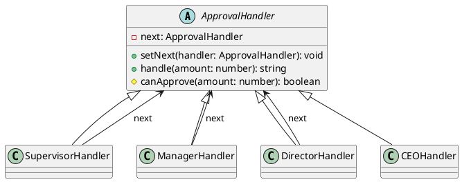

# Exercício 1: Sistema de Aprovação de Despesas

## 📋 Descrição do Problema

Crie um sistema de aprovação de despesas onde diferentes níveis de autoridade podem aprovar despesas conforme o valor:
- **Supervisor**: até R$ 100
- **Gerente**: até R$ 1.000
- **Diretor**: até R$ 10.000
- **CEO**: qualquer valor

O problema é que usar muitos `if/else` torna o código difícil de manter e estender.

## 🎯 Objetivo

Implementar o padrão **Chain of Responsibility** para encadear handlers de aprovação.

## 📐 Sugestão de Solução (PlantUML)

## ✅ Critérios de Avaliação

1. ✅ Classe abstrata `ApprovalHandler` com método `handle`
2. ✅ Handlers concretos para cada nível
3. ✅ Método `setNext()` para encadear handlers
4. ✅ Handler passa requisição para próximo se não puder aprovar
5. ✅ Testes validando cadeia de aprovação

## 💡 Dicas

- Handler aprova se `canApprove()` retorna true
- Senão, passa para próximo handler
- CEO sempre aprova (último da cadeia)

