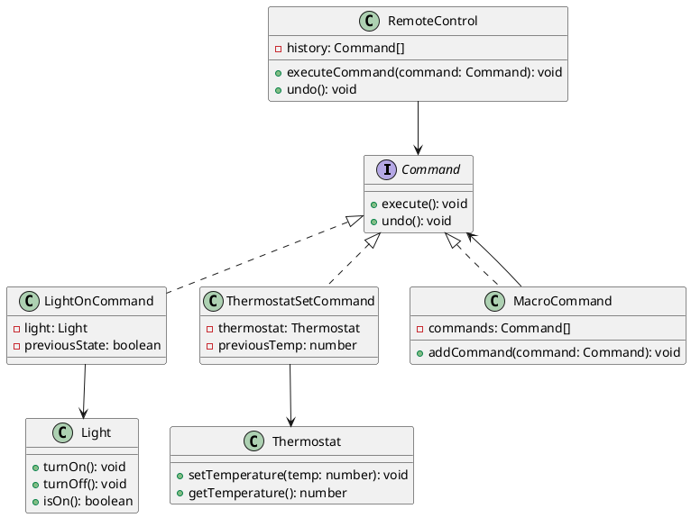

# Exercício 1: Sistema de Controle de Dispositivos Smart Home

## 📋 Descrição do Problema

Crie um sistema de controle de dispositivos smart home (luzes, termostato, portas) onde você precisa:
- Executar comandos
- Desfazer comandos (undo)
- Agendar comandos para execução futura
- Criar macros (sequências de comandos)

O problema é que sem Command, você precisa conhecer cada dispositivo diretamente, tornando difícil implementar undo/redo e agendamento.

## 🎯 Objetivo

Implementar o padrão **Command** para encapsular comandos como objetos.

## 📐 Sugestão de Solução (PlantUML)

## ✅ Critérios de Avaliação

1. ✅ Interface `Command` com métodos execute/undo
2. ✅ Comandos concretos que guardam estado para undo
3. ✅ Classe `RemoteControl` que gerencia histórico
4. ✅ Suporte para undo/redo
5. ✅ Testes validando execução e desfazer

## 💡 Dicas

- Comando guarda estado anterior para undo
- RemoteControl mantém pilha de comandos
- MacroCommand executa múltiplos comandos

