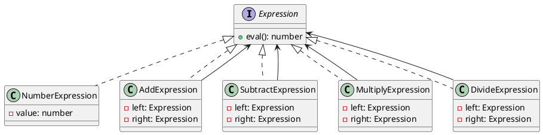

# Exercício 1: Interpretador de Expressões Matemáticas

## 📋 Descrição do Problema

Crie um sistema que avalia expressões matemáticas fornecidas como strings. O sistema deve suportar operações básicas (+, -, *, /) e parênteses.

O problema é que avaliar expressões manualmente com parsing inline torna o código difícil de manter e estender.

## 🎯 Objetivo

Implementar o padrão **Interpreter** para criar uma representação estruturada de expressões matemáticas.

## 📐 Sugestão de Solução (PlantUML)

## ✅ Critérios de Avaliação

1. ✅ Interface `Expression` com método `eval()`
2. ✅ Classe `NumberExpression` para números
3. ✅ Classes para operações (Add, Subtract, Multiply, Divide)
4. ✅ Expressões compostas avaliam recursivamente
5. ✅ Testes validando diferentes expressões

## 💡 Dicas

- NumberExpression retorna o valor diretamente
- Operações avaliam left e right recursivamente
- Crie um parser para construir a árvore de expressões

