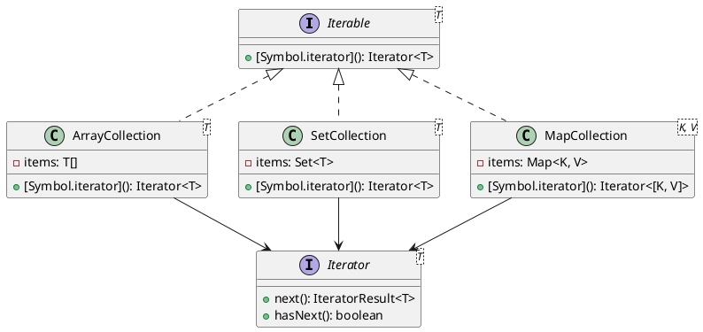

# Exercício 1: Sistema de Iteração de Coleções

## 📋 Descrição do Problema

Crie um sistema que precisa percorrer diferentes tipos de coleções (Array, Set, Map) sem expor a estrutura interna de cada uma.

O problema é que o cliente precisa conhecer os detalhes de implementação de cada coleção para iterar.

## 🎯 Objetivo

Implementar o padrão **Iterator** para fornecer interface uniforme de iteração.

## 📐 Sugestão de Solução (PlantUML)

## ✅ Critérios de Avaliação

1. ✅ Interface `Iterable` com `[Symbol.iterator]()`
2. ✅ Interface `Iterator` com métodos `next()` e `hasNext()`
3. ✅ Implementações concretas para diferentes coleções
4. ✅ Cliente usa `for...of` sem conhecer estrutura interna
5. ✅ Testes validando iteração em diferentes coleções

## 💡 Dicas

- Use `[Symbol.iterator]()` para implementar Iterable
- Iterator retorna `{ value, done }` em `next()`
- Suporte `for...of` nativo do JavaScript

