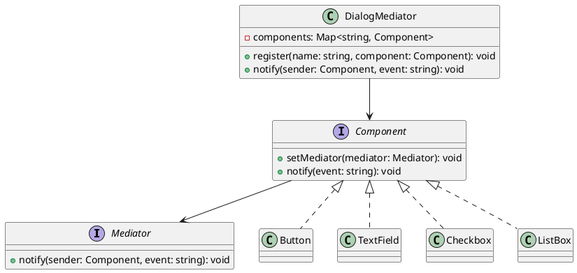

# Exercício 1: Sistema de Coordenação de Componentes UI

## 📋 Descrição do Problema

Crie um sistema de UI com múltiplos componentes (Button, TextField, Checkbox, ListBox) que precisam se comunicar sem referências diretas entre si.

O problema é que sem Mediator, cada componente precisa conhecer todos os outros, causando acoplamento muitos-para-muitos.

## 🎯 Objetivo

Implementar o padrão **Mediator** para centralizar comunicação entre componentes.

## 📐 Sugestão de Solução (PlantUML)

## ✅ Critérios de Avaliação

1. ✅ Interface `Mediator` com método `notify()`
2. ✅ Classe `DialogMediator` que coordena componentes
3. ✅ Interface `Component` que interage via mediator
4. ✅ Componentes não se referem diretamente entre si
5. ✅ Testes validando comunicação via mediator

## 💡 Dicas

- Mediator registra componentes e coordena comunicação
- Componentes chamam `notify()` no mediator
- Mediator decide qual componente notificar baseado no evento

