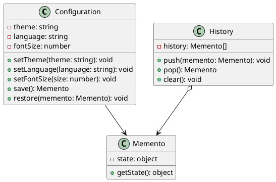

# Exercício 1: Sistema de Histórico de Configurações

## 📋 Descrição do Problema

Crie um sistema onde você precisa salvar e restaurar estados de configurações sem violar o encapsulamento. O sistema deve permitir undo/redo de mudanças.

O problema é que expor estado interno ou misturar lógica de histórico com lógica de negócio viola princípios de design.

## 🎯 Objetivo

Implementar o padrão **Memento** para capturar e restaurar estados sem violar encapsulamento.

## 📐 Sugestão de Solução (PlantUML)

## ✅ Critérios de Avaliação

1. ✅ Classe `Configuration` (Originator) com métodos save/restore
2. ✅ Classe `Memento` que encapsula estado
3. ✅ Classe `History` (Caretaker) que gerencia mementos
4. ✅ Estado não é exposto ao cliente
5. ✅ Testes validando save/restore e undo/redo

## 💡 Dicas

- Configuration cria memento com estado interno
- Memento só pode ser acessado por Configuration
- History mantém pilha de mementos para undo/redo

