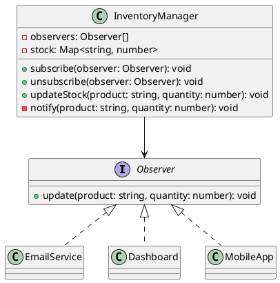

# Exercício 1: Sistema de Notificações de Estoque

## 📋 Descrição do Problema

Crie um sistema onde quando o estoque de um produto muda, múltiplos componentes precisam ser notificados:
- **EmailService**: envia email ao administrador
- **Dashboard**: atualiza gráfico em tempo real
- **MobileApp**: envia push notification

O problema é que o `InventoryManager` não deve conhecer todos esses componentes diretamente.

## 🎯 Objetivo

Implementar o padrão **Observer** para notificar múltiplos interessados sobre mudanças no estoque.

## 📐 Sugestão de Solução (PlantUML)

## ✅ Critérios de Avaliação

1. ✅ Interface `Observer` com método `update`
2. ✅ Classe `InventoryManager` que gerencia observers
3. ✅ Implementações concretas de observers
4. ✅ Notificação automática quando estoque muda
5. ✅ Testes validando notificações múltiplas

## 💡 Dicas

- Use array para armazenar observers
- Método `notify()` chama `update()` em todos os observers
- Método `updateStock()` atualiza estoque e chama `notify()`

