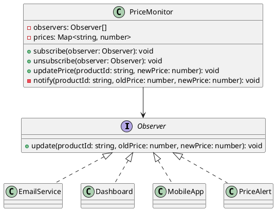

# Exercício 2: Sistema de Monitoramento de Preços

## 📋 Descrição do Problema

Crie um sistema onde quando o preço de um produto muda, múltiplos componentes precisam ser notificados:
- **EmailService**: envia email com novo preço
- **Dashboard**: atualiza gráfico de preços
- **MobileApp**: envia push notification
- **PriceAlert**: verifica se preço caiu para valor desejado

O problema é que o `PriceMonitor` não deve conhecer todos esses componentes diretamente.

## 🎯 Objetivo

Implementar o padrão **Observer** para notificar múltiplos interessados sobre mudanças de preço.

## 📐 Sugestão de Solução (PlantUML)

## ✅ Critérios de Avaliação

1. ✅ Interface `Observer` com método `update`
2. ✅ Classe `PriceMonitor` que gerencia observers
3. ✅ Implementações concretas de observers
4. ✅ Notificação automática quando preço muda
5. ✅ Testes validando notificações múltiplas

## 💡 Dicas

- Use array para armazenar observers
- Método `notify()` chama `update()` em todos os observers
- Método `updatePrice()` atualiza preço e chama `notify()`
- PriceAlert pode filtrar por preço desejado

