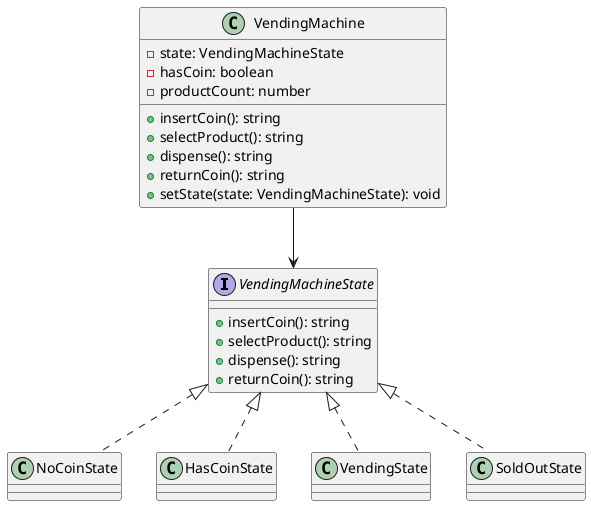

# Exercício 1: Sistema de Máquina de Vendas

## 📋 Descrição do Problema

Crie uma máquina de vendas que muda seu comportamento conforme o estado:
- **SemMoeda**: esperando moeda
- **ComMoeda**: moeda inserida, esperando seleção
- **Vendendo**: produto sendo entregue
- **SemProduto**: sem estoque

O problema é que usar muitos `if/else` baseados em flags torna o código difícil de manter e estender.

## 🎯 Objetivo

Implementar o padrão **State** para encapsular cada estado em uma classe.

## 📐 Sugestão de Solução (PlantUML)

## ✅ Critérios de Avaliação

1. ✅ Interface `VendingMachineState` com métodos de ação
2. ✅ Estados concretos para cada estado da máquina
3. ✅ Classe `VendingMachine` que delega para estado atual
4. ✅ Estados fazem transição para outros estados
5. ✅ Testes validando todas as transições

## 💡 Dicas

- Cada estado implementa comportamento específico
- Estado faz transição chamando `setState()`
- VendingMachine delega ações para estado atual

