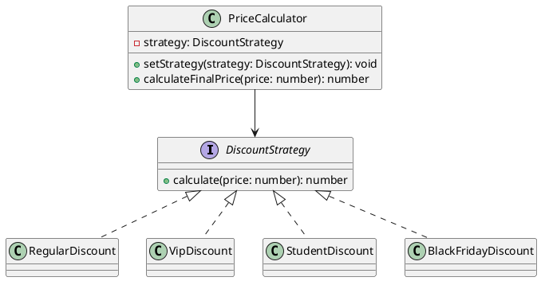

# Exercício 1: Sistema de Cálculo de Desconto

## 📋 Descrição do Problema

Crie um sistema de cálculo de desconto que varia conforme o tipo de cliente (Regular, VIP, Student) ou promoção (Black Friday, Natal). Cada tipo tem seu próprio algoritmo de desconto.

O problema é que usar muitos `if/else` torna o código difícil de manter e estender.

## 🎯 Objetivo

Implementar o padrão **Strategy** para encapsular cada algoritmo de desconto em uma classe separada.

## 📐 Sugestão de Solução (PlantUML)

## ✅ Critérios de Avaliação

1. ✅ Interface `DiscountStrategy` com método `calculate`
2. ✅ Implementações concretas para cada tipo de desconto
3. ✅ Classe `PriceCalculator` que usa estratégia
4. ✅ Possibilidade de trocar estratégia em runtime
5. ✅ Testes validando cada estratégia isoladamente

## 💡 Dicas

- Regular: sem desconto (100%)
- VIP: 15% de desconto
- Student: 10% de desconto
- Black Friday: 30% de desconto
- Use `setStrategy()` para trocar estratégia

