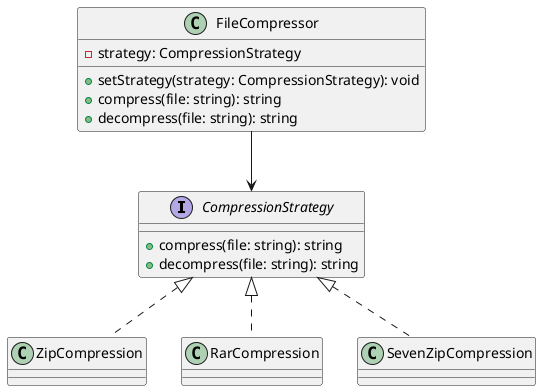

# Exercício 2: Sistema de Compressão de Arquivos

## 📋 Descrição do Problema

Crie um sistema de compressão de arquivos que varia conforme o algoritmo (ZIP, RAR, 7Z). Cada algoritmo tem seu próprio método de compressão.

O problema é que usar muitos `if/else` torna o código difícil de manter e estender.

## 🎯 Objetivo

Implementar o padrão **Strategy** para encapsular cada algoritmo de compressão em uma classe separada.

## 📐 Sugestão de Solução (PlantUML)

## ✅ Critérios de Avaliação

1. ✅ Interface `CompressionStrategy` com métodos compress/decompress
2. ✅ Implementações concretas para cada algoritmo
3. ✅ Classe `FileCompressor` que usa estratégia
4. ✅ Possibilidade de trocar estratégia em runtime
5. ✅ Testes validando cada estratégia isoladamente

## 💡 Dicas

- Cada estratégia implementa compressão específica
- FileCompressor delega para estratégia atual
- Use `setStrategy()` para trocar estratégia

