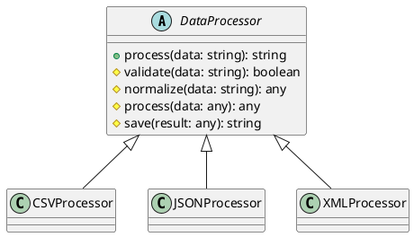

# Exercício 1: Sistema de Processamento de Dados

## 📋 Descrição do Problema

Crie um sistema de processamento de dados onde diferentes formatos (CSV, JSON, XML) seguem o mesmo fluxo:
1. Validar dados
2. Normalizar dados
3. Processar dados
4. Salvar resultado

Cada formato tem implementação diferente para cada passo, mas o fluxo geral é o mesmo.

## 🎯 Objetivo

Implementar o padrão **Template Method** para definir o fluxo uma vez e deixar subclasses implementarem os passos.

## 📐 Sugestão de Solução (PlantUML)

## ✅ Critérios de Avaliação

1. ✅ Classe abstrata `DataProcessor` com template method `process()`
2. ✅ Métodos abstratos para passos variáveis
3. ✅ Subclasses implementam passos específicos
4. ✅ Template method define fluxo fixo
5. ✅ Testes validando processamento em diferentes formatos

## 💡 Dicas

- Método `process()` define fluxo: validate → normalize → process → save
- Subclasses implementam apenas métodos abstratos
- Métodos protegidos (#) podem ser sobrescritos

