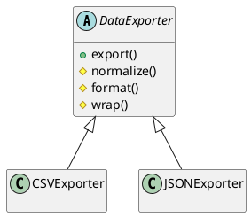

### Por que Template Method?

Quando várias variantes de um fluxo compartilham a mesma estrutura, mas diferem em alguns passos. O método template define o esqueleto uma vez e deixa as subclasses preencherem os pontos variáveis.

### Problema: Cenário Caótico SEM Template Method

**Código duplicado e estrutura repetida:**

```typescript
// ❌ PROBLEMA: Estrutura repetida em cada classe
class CSVExporter {
  export(data: unknown[]): string {
    // ❌ Estrutura duplicada
    const normalized = this.normalize(data);
    const formatted = this.formatCSV(normalized);
    return this.wrap(formatted);
  }
  
  normalize(data: unknown[]): Record<string, unknown>[] {
    return data as Record<string, unknown>[];
  }
  
  formatCSV(rows: Record<string, unknown>[]): string {
    // Lógica específica de CSV
    const headers = Object.keys(rows[0]);
    return headers.join(',') + '\n' + rows.map(r => Object.values(r).join(',')).join('\n');
  }
  
  wrap(out: string): string { return out; }
}

class JSONExporter {
  export(data: unknown[]): string {
    // ❌ Mesma estrutura repetida
    const normalized = this.normalize(data);
    const formatted = this.formatJSON(normalized);
    return this.wrap(formatted);
  }
  
  normalize(data: unknown[]): Record<string, unknown>[] {
    // ❌ Código duplicado
    return data as Record<string, unknown>[];
  }
  
  formatJSON(rows: Record<string, unknown>[]): string {
    return JSON.stringify(rows);
  }
  
  wrap(out: string): string { 
    // ❌ Código duplicado
    return `JSON:${out}`;
  }
}

// ❌ Problemas:
// 1. Estrutura duplicada (normalize, format, wrap)
// 2. Código repetido entre classes
// 3. Difícil mudar a estrutura (ex: adicionar validação)
// 4. Violação do princípio DRY (Don't Repeat Yourself)
// 5. Difícil garantir que todas as classes seguem o mesmo fluxo
```

**Problemas:**
- Estrutura duplicada em cada classe
- Código repetido entre implementações
- Difícil mudar a estrutura sem modificar todas as classes
- Violação do princípio DRY
- Difícil garantir consistência do fluxo

### Solução: Template Method Pattern

O Template Method define o esqueleto uma vez:

```typescript
// ✅ SOLUÇÃO: Estrutura definida uma vez, subclasses implementam passos variáveis
abstract class DataExporter {
  export(data: unknown[]): string {
    // Template fixo: normalize -> format -> wrap
    const normalized = this.normalize(data);
    const formatted = this.format(normalized);
    return this.wrap(formatted);
  }
  // Subclasses implementam apenas format()
}
```

### Composição

- **AbstractClass (DataExporter)**: define o template `export()` e passos abstratos/ganchos.
- **ConcreteClasses (CSVExporter, JSONExporter)**: implementam os passos variáveis.
- **Client (Application)**: usa o template sem conhecer os detalhes.

### Dicas

- Exponha apenas os passos que precisam variar; mantenha invariantes no template.

---

# PlantUML



---

### Uso

```ts
import { Application } from "./application";
console.log(new Application().run());
```


