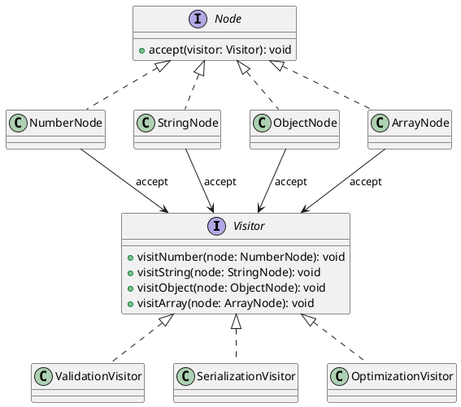

# Exercício 1: Sistema de Análise de Estrutura de Dados

## 📋 Descrição do Problema

Crie um sistema que precisa aplicar diferentes análises (Validação, Serialização, Otimização) sobre uma estrutura de dados (AST, JSON, XML) sem modificar as classes da estrutura.

O problema é que sem Visitor, cada novo algoritmo requer modificar todas as classes da estrutura.

## 🎯 Objetivo

Implementar o padrão **Visitor** para separar algoritmos das estruturas de dados.

## 📐 Sugestão de Solução (PlantUML)

## ✅ Critérios de Avaliação

1. ✅ Interface `Visitor` com métodos visit para cada tipo de nó
2. ✅ Interface `Node` com método `accept(visitor)`
3. ✅ Implementações concretas de nodes
4. ✅ Implementações concretas de visitors
5. ✅ Testes validando diferentes visitors sobre a mesma estrutura

## 💡 Dicas

- Node chama `visitor.visitX(this)` no método accept
- Visitor implementa algoritmo específico para cada tipo de nó
- Adicionar novo algoritmo = adicionar novo visitor (sem modificar nodes)

