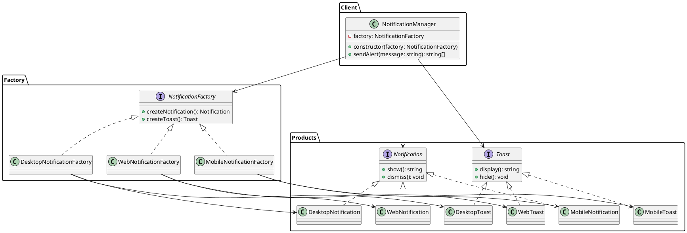

# Exercício 1: Sistema de Notificações Multi-Plataforma

## 📋 Descrição do Problema

Você precisa criar um sistema de notificações que funcione em diferentes plataformas (Web, Mobile, Desktop). Cada plataforma tem suas próprias variações de componentes de notificação:

- **Web**: `WebNotification` e `WebToast`
- **Mobile**: `MobileNotification` e `MobileToast`
- **Desktop**: `DesktopNotification` e `DesktopToast`

O problema é que você precisa garantir que os componentes sejam compatíveis entre si (ex: não misturar `WebNotification` com `MobileToast`). Além disso, o sistema precisa ser facilmente extensível para novas plataformas no futuro.

## 🎯 Objetivo

Implementar o padrão **Abstract Factory** para criar famílias de componentes de notificação compatíveis por plataforma.

## 📐 Sugestão de Solução (PlantUML)

## ✅ Critérios de Avaliação

1. ✅ Criação de interfaces abstratas (`Notification`, `Toast`)
2. ✅ Implementação de produtos concretos para cada plataforma
3. ✅ Criação de fábricas abstratas e concretas
4. ✅ Cliente (`NotificationManager`) usa apenas interfaces
5. ✅ Testes unitários validando compatibilidade dos produtos

## 💡 Dicas

- Use enums para identificar as plataformas
- Garanta que cada fábrica retorne produtos compatíveis
- Implemente um método `sendAlert` que use ambos os produtos da família

