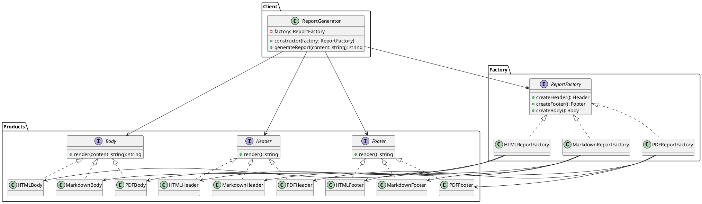

# Exercício 2: Sistema de Relatórios Multi-Formato

## 📋 Descrição do Problema

Um sistema de relatórios precisa gerar documentos em diferentes formatos (PDF, HTML, Markdown) e com diferentes estilos (Formal, Casual, Técnico). Cada combinação de formato e estilo tem componentes específicos:

- **Formato PDF**: `PDFHeader`, `PDFFooter`, `PDFBody`
- **Formato HTML**: `HTMLHeader`, `HTMLFooter`, `HTMLBody`
- **Formato Markdown**: `MarkdownHeader`, `MarkdownFooter`, `MarkdownBody`

Cada estilo (Formal, Casual, Técnico) modifica como esses componentes são renderizados. O sistema precisa garantir que não seja possível misturar componentes de formatos diferentes (ex: `PDFHeader` com `HTMLBody`).

## 🎯 Objetivo

Implementar o padrão **Abstract Factory** para criar famílias de componentes de relatório compatíveis por formato.

## 📐 Sugestão de Solução (PlantUML)

## ✅ Critérios de Avaliação

1. ✅ Três interfaces abstratas para componentes de relatório
2. ✅ Implementações concretas para cada formato
3. ✅ Fábricas que garantem compatibilidade
4. ✅ Cliente gera relatórios completos usando apenas interfaces
5. ✅ Testes validando que componentes são do mesmo formato

## 💡 Dicas

- O método `generateReport` deve concatenar header + body + footer
- Use estilos diferentes dentro de cada formato (ex: PDFFormal, PDFCasual)
- Considere adicionar um método `getStyle()` em cada componente

