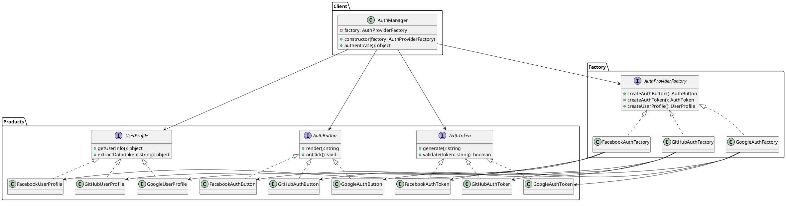

# Exercício 3: Sistema de Autenticação Multi-Provedor

## 📋 Descrição do Problema

Um sistema precisa suportar autenticação através de diferentes provedores (Google, Facebook, GitHub). Cada provedor tem componentes específicos:

- **Google**: `GoogleAuthButton`, `GoogleAuthToken`, `GoogleUserProfile`
- **Facebook**: `FacebookAuthButton`, `FacebookAuthToken`, `FacebookUserProfile`
- **GitHub**: `GitHubAuthButton`, `GitHubAuthToken`, `GitHubUserProfile`

O sistema precisa garantir que não seja possível misturar componentes de provedores diferentes (ex: `GoogleAuthButton` com `FacebookAuthToken`). Além disso, o sistema deve ser facilmente extensível para novos provedores.

## 🎯 Objetivo

Implementar o padrão **Abstract Factory** para criar famílias de componentes de autenticação compatíveis por provedor.

## 📐 Sugestão de Solução (PlantUML)

## ✅ Critérios de Avaliação

1. ✅ Três interfaces abstratas para componentes de autenticação
2. ✅ Implementações concretas para cada provedor
3. ✅ Fábricas que garantem compatibilidade
4. ✅ Cliente usa apenas interfaces para autenticar
5. ✅ Testes validando fluxo completo de autenticação

## 💡 Dicas

- O método `authenticate` deve: renderizar button → gerar token → extrair perfil
- Implemente validação de token para cada provedor
- Considere adicionar um enum `AuthProvider` para identificar o provedor

