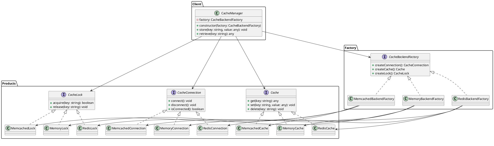

# Exercício 4: Sistema de Cache Multi-Backend

## 📋 Descrição do Problema

Um sistema precisa suportar diferentes backends de cache (Redis, Memcached, In-Memory). Cada backend tem componentes específicos:

- **Redis**: `RedisConnection`, `RedisCache`, `RedisLock`
- **Memcached**: `MemcachedConnection`, `MemcachedCache`, `MemcachedLock`
- **In-Memory**: `MemoryConnection`, `MemoryCache`, `MemoryLock`

O sistema precisa garantir que não seja possível misturar componentes de backends diferentes (ex: `RedisConnection` com `MemcachedCache`). O sistema deve permitir trocar de backend facilmente sem modificar o código cliente.

## 🎯 Objetivo

Implementar o padrão **Abstract Factory** para criar famílias de componentes de cache compatíveis por backend.

## 📐 Sugestão de Solução (PlantUML)

## ✅ Critérios de Avaliação

1. ✅ Três interfaces abstratas para componentes de cache
2. ✅ Implementações concretas para cada backend
3. ✅ Fábricas que garantem compatibilidade
4. ✅ Cliente usa apenas interfaces
5. ✅ Testes validando operações de cache

## 💡 Dicas

- O método `store` deve: conectar → adquirir lock → set → release lock
- O método `retrieve` deve: conectar → get → retornar
- Implemente tratamento de erros para conexão

