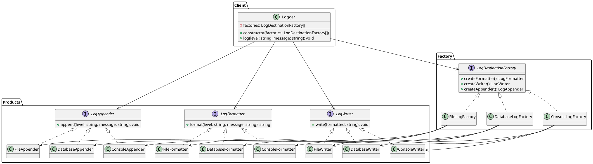

# Exercício 5: Sistema de Logging Multi-Destino

## 📋 Descrição do Problema

Um sistema precisa suportar logging para diferentes destinos (Console, File, Database). Cada destino tem componentes específicos:

- **Console**: `ConsoleFormatter`, `ConsoleWriter`, `ConsoleAppender`
- **File**: `FileFormatter`, `FileWriter`, `FileAppender`
- **Database**: `DatabaseFormatter`, `DatabaseWriter`, `DatabaseAppender`

O sistema precisa garantir que não seja possível misturar componentes de destinos diferentes (ex: `ConsoleFormatter` com `FileWriter`). O sistema deve permitir configurar múltiplos destinos simultaneamente.

## 🎯 Objetivo

Implementar o padrão **Abstract Factory** para criar famílias de componentes de logging compatíveis por destino.

## 📐 Sugestão de Solução (PlantUML)

## ✅ Critérios de Avaliação

1. ✅ Três interfaces abstratas para componentes de logging
2. ✅ Implementações concretas para cada destino
3. ✅ Fábricas que garantem compatibilidade
4. ✅ Cliente suporta múltiplos destinos simultaneamente
5. ✅ Testes validando logs em diferentes destinos

## 💡 Dicas

- O método `log` deve: formatar → escrever → anexar para cada destino
- Suporte múltiplos níveis de log (INFO, WARN, ERROR)
- Implemente rotação de arquivos para `FileAppender`

