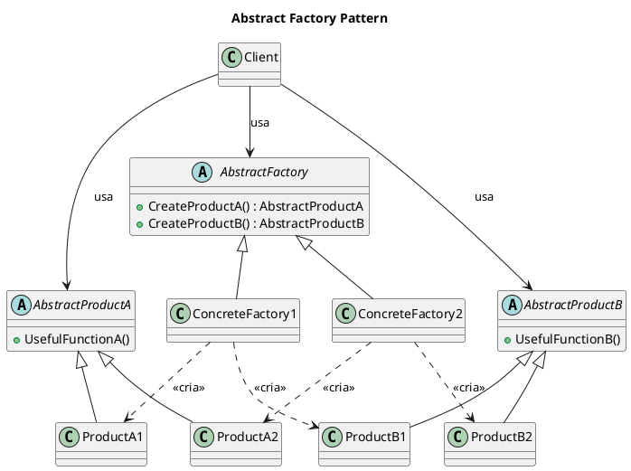

Os padrões de projeto (ou *design patterns*) são soluções simples para problemas específicos no projeto de software orientado a objetos, capturando a experiência e o aperfeiçoamento obtidos ao longo do tempo.

## 1. Análise Didática dos Padrões de Criação (Creational Patterns)

Os **Padrões de Criação** são um dos três tipos de padrões de projeto (juntamente com os Estruturais e Comportamentais). Eles se preocupam com o processo de **criação de objetos**.

### Propósito e Princípios Chave

Os Padrões de Criação são fundamentais porque eles **abstraem o processo de instanciação**.

1.  **Independência do Sistema:** Eles ajudam a tornar um sistema independente de como seus objetos são criados, compostos e representados.
2.  **Encapsulamento:** Todos eles encapsulam o conhecimento sobre quais classes concretas são usadas e ocultam o modo como as instâncias são criadas e compostas.
3.  **Comprometimento Abstrato:** O sistema, em geral, só conhece os objetos por meio de suas classes abstratas (interfaces).
4.  **Flexibilidade:** Eles dão grande flexibilidade ao que, como e quando é criado, permitindo configurar o sistema com "objetos-produto" que variam amplamente em estrutura e funcionalidade.

### Classificação e Escopo

Os Padrões de Criação são divididos com base no seu **escopo**, ou seja, se se aplicam primariamente a **classes** ou a **objetos**:

| Finalidade | Escopo de Classe | Escopo de Objeto |
| :--- | :--- | :--- |
| **Criação** | Factory Method (112) | Abstract Factory (95), Builder (104), Prototype (121), Singleton (130) |

*   **Padrões de Criação de Classe:** Usam herança para variar a classe que é instanciada.
*   **Padrões de Criação de Objeto:** Delegam a instanciação para outro objeto, baseando-se mais na **composição de objetos** do que na herança de classes.

### Catálogo dos Padrões de Criação

O catálogo contém cinco padrões de criação:

| Padrão | Intenção (O que faz) |
| :--- | :--- |
| **Abstract Factory (95)** | Fornece uma interface para criação de famílias de objetos relacionados ou dependentes sem especificar suas classes concretas. |
| **Builder (104)** | Separa a construção de um objeto complexo da sua representação, de modo que o mesmo processo de construção possa criar diferentes representações. |
| **Factory Method (112)** | Define uma interface para criar um objeto, mas deixa as subclasses decidirem qual classe a ser instanciada. Permite a uma classe postergar a instanciação às subclasses. |
| **Prototype (121)** | Especifica os tipos de objetos a serem criados usando uma instância prototípica e criar novos objetos copiando esse protótipo. |
| **Singleton (130)** | Garante que uma classe tenha somente uma instância e fornece um ponto global de acesso para ela. |

---

## 2. Implementação de Diagramas de Classe (UML em PlantUML)

Embora as fontes usem a notação baseada no OMT (Object Modeling Technique), esta notação é conceitualmente similar ao UML de Diagramas de Classe.

A chave para o diagrama é representar os **participantes** e seus **relacionamentos**.

### Notação OMT/UML Conforme as Fontes

| Conceito | Notação OMT (Descrição) [Citação] |
| :--- | :--- |
| **Classe (Concreta)** | Caixa (retângulo) com o nome no topo, operações abaixo, variáveis de instância abaixo das operações. |
| **Classe Abstrata/Interface** | O nome da classe ou operação aparece em *itálico*. Não pode ser instanciada. |
| **Herança** | Linha vertical sólida com um triângulo não preenchido na extremidade da classe mãe/ancestral. |
| **Associação** | Flecha de linha cheia (denotando que um objeto tem conhecimento de outro). |
| **Agregação** | Flecha de linha cheia com um losango não preenchido na sua origem (classe agregadora). |
| **Criação/Instanciação** | Flecha tracejada apontando para a classe que é instanciada. |

### Exemplo de Análise e Estrutura: Abstract Factory

Vamos analisar a estrutura do **Abstract Factory** (Fábrica Abstrata) para aplicar os conceitos de diagramação:

1.  **Participantes:** `AbstractFactory`, `ConcreteFactory`, `AbstractProduct`, `ConcreteProduct`, e `Client`.
2.  **Relacionamentos Chave:**
    *   `ConcreteFactory` herda de `AbstractFactory`.
    *   `ConcreteProduct` herda de `AbstractProduct`.
    *   `Client` usa (`associação`) `AbstractFactory` e `AbstractProduct`.

#### Diagrama Conceitual (PlantUML)

Para implementar este diagrama conceitualmente em PlantUML, mapeamos a notação OMT (sem entrar nos detalhes sintáticos do PlantUML, que não estão nas fontes, mas focando na estrutura):



**Análise do Diagrama:** O diagrama ilustra o **acoplamento fraco**. O `Client` interage apenas com o `AbstractFactory` e os `AbstractProducts`. Ele está **isolado das classes concretas** (`ProductA1`, `ProductB2`, etc.), que são instanciadas pelas fábricas concretas (ex: `ConcreteFactory1`). Para mudar a família de produtos, basta instanciar uma fábrica concreta diferente (`ConcreteFactory2`), sem modificar o código do `Client`.

---

## 3. Implementação de Classes em TypeScript

O TypeScript é uma linguagem orientada a objetos (OO) que se alinha muito bem com os princípios dos padrões de projeto.

### Princípio Fundamental de Programação OO

A implementação dos Padrões de Criação em TypeScript deve seguir rigorosamente o princípio: **"Programe para uma interface, não para uma implementação"**.

Isso significa que o código do cliente deve sempre referenciar tipos definidos por interfaces ou classes abstratas, em vez de classes concretas específicas.

### Mapeamento de Conceitos (TypeScript)

| Conceito OO | Tipo/Sintaxe em TypeScript | Justificativa/Uso nos Padrões |
| :--- | :--- | :--- |
| **Interface Abstrata (pura)** | `interface` | Define o contrato (`AbstractProduct`, `AbstractFactory`) que isola o cliente da implementação. |
| **Classe Abstrata** | `abstract class` | Usada quando é necessário fornecer uma implementação base (concreta) para algumas operações e postergar a definição de outras para subclasses. |
| **Herança** | `extends` | Mecanismo de reuso de código e interface. Usado extensivamente em `Factory Method` e para criar a hierarquia `AbstractProduct`. |
| **Composição** | Propriedades de classe | Preferida em relação à herança de classe para obter flexibilidade e reuso de caixa preta (*black-box reuse*). Usada em `Abstract Factory` (o cliente compõe a fábrica) e `Builder`. |
| **Instanciação Abstrata** | Delegação interna | Substitui o operador `new ConcreteClass()` no código do cliente. A instanciação é delegada a uma fábrica (`Factory Method`, `Abstract Factory`) ou a um mecanismo de clonagem (`Prototype`). |

### Exemplo de Estrutura em TypeScript (Abstract Factory)

A implementação em TypeScript reforça as interfaces (`AbstractProductA`, `AbstractFactory`) e garante que as classes que usam esses objetos (`Client`) não saibam dos detalhes de implementação (`ProductA1`, `ConcreteFactory1`).

```typescript
// Interfaces dos Produtos Abstratos
interface AbstractProductA {
    usefulFunctionA(): string;
}

interface AbstractProductB {
    usefulFunctionB(): string;
    // B colabora com A (exige acoplamento abstrato)
    collaborationWithA(collaborator: AbstractProductA): string;
}

// Interface da Fábrica Abstrata
interface AbstractFactory {
    createProductA(): AbstractProductA;
    createProductB(): AbstractProductB;
}

// Implementação dos Produtos Concretos (Família 1)
class ProductA1 implements AbstractProductA {
    public usefulFunctionA(): string {
        return "O resultado da A1.";
    }
}

class ProductB1 implements AbstractProductB {
    public usefulFunctionB(): string {
        return "O resultado da B1.";
    }

    // Garante que ProductB1 use apenas a interface de AbstractProductA
    public collaborationWithA(collaborator: AbstractProductA): string {
        const resultA = collaborator.usefulFunctionA();
        return `B1 colabora com (${resultA})`;
    }
}

// Fábrica Concreta (Família 1)
class ConcreteFactory1 implements AbstractFactory {
    // Implementa as operações para criar objetos-produto concretos
    public createProductA(): AbstractProductA {
        return new ProductA1(); // <<cria>> ProductA1
    }

    public createProductB(): AbstractProductB {
        return new ProductB1(); // <<cria>> ProductB1
    }
}

// Cliente (Usa as interfaces, não as classes concretas)
class Client {
    // O cliente é configurado com um objeto AbstractFactory
    public useFactory(factory: AbstractFactory): void {
        const productA = factory.createProductA();
        const productB = factory.createProductB();

        console.log(productA.usefulFunctionA());
        console.log(productB.usefulFunctionB());
        console.log(productB.collaborationWithA(productA));
    }
}

/*
Configuração e Uso
*/

// O cliente é configurado em tempo de execução com a fábrica desejada.
// Esta configuração é feita em um ponto do sistema antes de ser usada (princípio Singleton/Configuration).
const clientApp = new Client();
const factory1 = new ConcreteFactory1();

clientApp.useFactory(factory1); 

// Para usar uma nova família de produtos (Family 2), basta criar a nova ConcreteFactory
// e passá-la para o cliente, sem alterar a classe Client.
// clientApp.useFactory(new ConcreteFactory2()); 
```