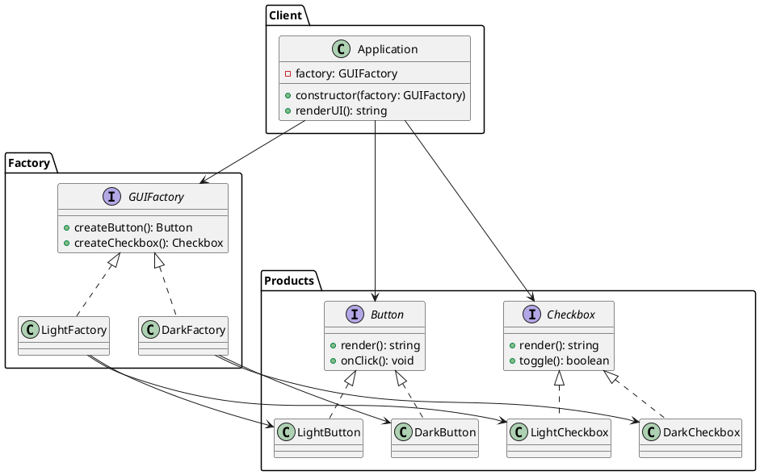

### Por que Abstract Factory?

Quando você tem **várias famílias de produtos** (aqui: `Button` + `Checkbox`) e quer **trocar a família inteira** (tema Light vs Dark) sem mudar o cliente. A fábrica abstrata define interfaces para criar cada produto; fábricas concretas produzem variações consistentes entre si. Útil para manter coesão entre produtos e isolar troca de famílias.

### Problema: Cenário Caótico SEM Abstract Factory

**Criação direta de produtos e acoplamento forte:**

```typescript
// ❌ PROBLEMA: Cliente conhece classes concretas e cria produtos diretamente
class Application {
  private button: LightButton | DarkButton;
  private checkbox: LightCheckbox | DarkCheckbox;

  constructor(theme: 'light' | 'dark') {
    // ❌ Acoplamento forte: cliente conhece classes concretas
    if (theme === 'light') {
      this.button = new LightButton();
      this.checkbox = new LightCheckbox();
    } else {
      this.button = new DarkButton();
      this.checkbox = new DarkCheckbox();
    }
  }

  renderUI() {
    return {
      button: this.button.render(),
      checkbox: this.checkbox.render(),
    };
  }
}

// ❌ Problemas:
// 1. Se adicionar novo tema (ex: 'high-contrast'), precisa modificar Application
// 2. Se adicionar novo produto (ex: Input), precisa modificar Application
// 3. Fácil criar produtos incompatíveis: LightButton + DarkCheckbox (erro!)
// 4. Difícil testar: precisa criar objetos concretos
// 5. Lógica de criação espalhada por todo o código
```

**Problemas:**
- Cliente acoplado a classes concretas
- Troca de tema requer modificação no cliente
- Risco de misturar produtos de famílias diferentes
- Difícil testar e manter
- Violação do princípio Open/Closed (aberto para extensão, fechado para modificação)

### Solução: Abstract Factory Pattern

O Abstract Factory encapsula a criação de famílias inteiras:

```typescript
// ✅ SOLUÇÃO: Cliente depende apenas de interfaces
class Application {
  constructor(factory: GUIFactory) {
    this.button = factory.createButton();  // Factory decide qual criar
    this.checkbox = factory.createCheckbox(); // Factory garante compatibilidade
  }
}

// Trocar tema = trocar fábrica (sem modificar Application)
const lightApp = new Application(new LightFactory());
const darkApp = new Application(new DarkFactory());
```

### Pontos-chave (detalhes)

* **AbstractFactory**: interface que declara métodos para criar cada produto da família (`createButton()`, `createCheckbox()`).
* **ConcreteFactory**: implementa a AbstractFactory e cria produtos concretos compatíveis (ex.: `LightFactory` cria `LightButton` e `LightCheckbox`).
* **AbstractProduct**: interfaces dos produtos (ex.: `Button`, `Checkbox`).
* **ConcreteProduct**: implementações concretas dos produtos.
* **Client**: depende apenas das interfaces, nunca das implementações concretas. Recebe uma fábrica e usa os produtos que ela cria.
* Vantagem: trocar tema = trocar fábrica; cliente continua o mesmo.

---

# PlantUML (diagrama de classes)



---

## Estrutura do Código

A implementação segue a estrutura de pastas do projeto:

- **`products/abstract_interfaces/`**: Define as interfaces abstratas (`Button`, `Checkbox`, `Component`)
- **`products/concrete/`**: Implementações concretas dos produtos (`LightButton`, `LightCheckbox`)
- **`factory/`**: Interfaces e implementações das fábricas (`GUIFactory`, `LightFactory`)
- **`application.ts`**: Cliente que usa a fábrica para criar produtos
- **`tests/`**: Testes unitários demonstrando o padrão

### Como Estudar Este Padrão

1. **Leia o código**: Comece por `application.ts` para entender como o cliente usa o padrão
2. **Entenda as interfaces**: Examine `products/abstract_interfaces/` para ver os contratos
3. **Veja as implementações**: Estude `products/concrete/` e `factory/` para entender a criação
4. **Execute os testes**: Rode `tests/ui_factory_tests.spec.ts` para ver o padrão em ação
5. **Experimente**: Tente adicionar um novo tema (ex: HighContrast) seguindo o mesmo padrão

### Uso Prático

```typescript
import { Application } from "./application";
import { LightFactory } from "./factory/light_factory";

// O cliente recebe uma fábrica e usa os produtos sem conhecer detalhes
const app = new Application(new LightFactory());
const ui = app.renderUI();
console.log(ui.button); // [LightButton] rendered with light background
console.log(ui.checkbox); // [LightCheckbox] unchecked
```

### Exercícios Práticos

- **Adicionar novo tema**: Crie uma `HighContrastFactory` seguindo o mesmo padrão
- **Adicionar novo produto**: Adicione um `Input` à família de produtos
- **Testar incompatibilidade**: Tente misturar produtos de famílias diferentes e veja como o padrão previne erros
