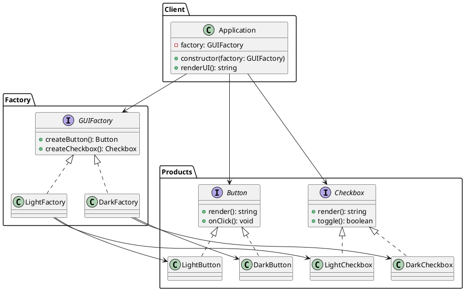

### Por que Abstract Factory?

Quando você tem **várias famílias de produtos** (aqui: `Button` + `Checkbox`) e quer **trocar a família inteira** (tema Light vs Dark) sem mudar o cliente. A fábrica abstrata define interfaces para criar cada produto; fábricas concretas produzem variações consistentes entre si. Útil para manter coesão entre produtos e isolar troca de famílias.

### Pontos-chave (detalhes)

* **AbstractFactory**: interface que declara métodos para criar cada produto da família (`createButton()`, `createCheckbox()`).
* **ConcreteFactory**: implementa a AbstractFactory e cria produtos concretos compatíveis (ex.: `LightFactory` cria `LightButton` e `LightCheckbox`).
* **AbstractProduct**: interfaces dos produtos (ex.: `Button`, `Checkbox`).
* **ConcreteProduct**: implementações concretas dos produtos.
* **Client**: depende apenas das interfaces, nunca das implementações concretas. Recebe uma fábrica e usa os produtos que ela cria.
* Vantagem: trocar tema = trocar fábrica; cliente continua o mesmo.

---

# PlantUML ( copie e cole num renderizador PlantUML )



---

# Código TypeScript (simples, testável)

Vou entregar tudo em módulos/arquivos conceituais. Você pode adaptar para monorepo ou estrutura que preferir.

**1) src/products.ts**

```ts
// src/products.ts
export interface Button {
  render(): string;
  onClick(): void;
}

export interface Checkbox {
  render(): string;
  toggle(): boolean;
}
```

**2) src/factories.ts**

```ts
// src/factories.ts
import { Button, Checkbox } from './products';

export interface GUIFactory {
  createButton(): Button;
  createCheckbox(): Checkbox;
}
```

**3) src/concreteProducts.ts**

```ts
// src/concreteProducts.ts
import { Button, Checkbox } from './products';

// Light theme products
export class LightButton implements Button {
  private theme = 'Light';
  render(): string {
    return `[${this.theme}Button] rendered with light background`;
  }
  onClick(): void {
    // behavior could be more complex
    // simply log or simulate
    // (for tests we won't rely on console)
  }
}

export class LightCheckbox implements Checkbox {
  private theme = 'Light';
  private checked = false;
  render(): string {
    return `[${this.theme}Checkbox] ${this.checked ? 'checked' : 'unchecked'}`;
  }
  toggle(): boolean {
    this.checked = !this.checked;
    return this.checked;
  }
}

// Dark theme products
export class DarkButton implements Button {
  private theme = 'Dark';
  render(): string {
    return `[${this.theme}Button] rendered with dark background`;
  }
  onClick(): void {}
}

export class DarkCheckbox implements Checkbox {
  private theme = 'Dark';
  private checked = false;
  render(): string {
    return `[${this.theme}Checkbox] ${this.checked ? 'checked' : 'unchecked'}`;
  }
  toggle(): boolean {
    this.checked = !this.checked;
    return this.checked;
  }
}
```

**4) src/concreteFactories.ts**

```ts
// src/concreteFactories.ts
import { GUIFactory } from './factories';
import { Button, Checkbox } from './products';
import { LightButton, LightCheckbox, DarkButton, DarkCheckbox } from './concreteProducts';

export class LightFactory implements GUIFactory {
  createButton(): Button {
    return new LightButton();
  }
  createCheckbox(): Checkbox {
    return new LightCheckbox();
  }
}

export class DarkFactory implements GUIFactory {
  createButton(): Button {
    return new DarkButton();
  }
  createCheckbox(): Checkbox {
    return new DarkCheckbox();
  }
}
```

**5) src/application.ts (client)**

```ts
// src/application.ts
import { GUIFactory } from './factories';
import { Button, Checkbox } from './products';

export class Application {
  private button: Button;
  private checkbox: Checkbox;

  constructor(factory: GUIFactory) {
    this.button = factory.createButton();
    this.checkbox = factory.createCheckbox();
  }

  renderUI(): { button: string; checkbox: string } {
    return {
      button: this.button.render(),
      checkbox: this.checkbox.render(),
    };
  }

  toggleCheckbox(): boolean {
    return this.checkbox.toggle();
  }
}
```

---

# Testes (Jest + TypeScript)

* Fábricas criam produtos da família correta.
* Produtos têm comportamento esperado (render strings e toggle).
* Aplicação usa a fábrica para renderizar UI consistente.


**tests/factories.test.ts**

```ts
// tests/factories.test.ts
import { LightFactory, DarkFactory } from '../src/concreteFactories';
import { LightButton, LightCheckbox, DarkButton, DarkCheckbox } from '../src/concreteProducts';

describe('Concrete Factories produce matching families', () => {
  test('LightFactory creates LightButton and LightCheckbox', () => {
    const f = new LightFactory();
    const b = f.createButton();
    const c = f.createCheckbox();

    expect(b.render()).toContain('[LightButton]');
    expect(c.render()).toContain('[LightCheckbox]');
  });

  test('DarkFactory creates DarkButton and DarkCheckbox', () => {
    const f = new DarkFactory();
    const b = f.createButton();
    const c = f.createCheckbox();

    expect(b.render()).toContain('[DarkButton]');
    expect(c.render()).toContain('[DarkCheckbox]');
  });
});
```

**tests/products.test.ts**

```ts
// tests/products.test.ts
import { LightCheckbox, DarkCheckbox, LightButton, DarkButton } from '../src/concreteProducts';

describe('Product behaviors', () => {
  test('Checkbox toggle changes state', () => {
    const lc = new LightCheckbox();
    expect(lc.render()).toContain('unchecked');
    expect(lc.toggle()).toBe(true);
    expect(lc.render()).toContain('checked');
    expect(lc.toggle()).toBe(false);
  });

  test('Button render contains theme', () => {
    const lb = new LightButton();
    expect(lb.render()).toContain('LightButton');

    const db = new DarkButton();
    expect(db.render()).toContain('DarkButton');
  });
});
```

**tests/application.test.ts**

```ts
// tests/application.test.ts
import { Application } from '../src/application';
import { LightFactory, DarkFactory } from '../src/concreteFactories';

describe('Application (client) uses factories', () => {
  test('Application renders Light UI when given LightFactory', () => {
    const app = new Application(new LightFactory());
    const ui = app.renderUI();
    expect(ui.button).toContain('[LightButton]');
    expect(ui.checkbox).toContain('[LightCheckbox]');
  });

  test('Application toggles checkbox state correctly', () => {
    const app = new Application(new DarkFactory());
    expect(app.renderUI().checkbox).toContain('unchecked');
    const after = app.toggleCheckbox();
    expect(after).toBe(true);
  });
});
```

---


