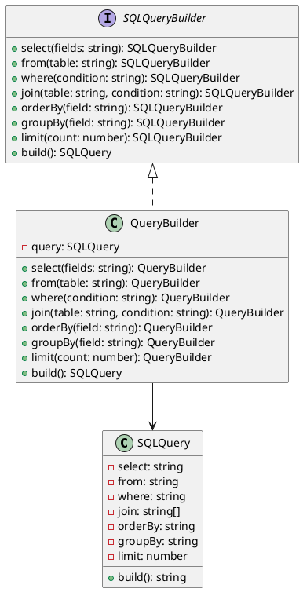

# Exercício 1: Construção de Consultas SQL

## 📋 Descrição do Problema

Crie um sistema para construir consultas SQL complexas passo a passo. Uma consulta SQL pode ter várias partes opcionais: SELECT, FROM, WHERE, JOIN, ORDER BY, GROUP BY, LIMIT. 

O problema é que construir consultas SQL com muitos parâmetros opcionais em um construtor seria confuso e propenso a erros:
```typescript
new SQLQuery('*', 'users', 'age > 18', null, 'name', null, 10); // Qual parâmetro é qual?
```

## 🎯 Objetivo

Implementar o padrão **Builder** para construir consultas SQL de forma fluente e legível.

## 📐 Sugestão de Solução (PlantUML)



## ✅ Critérios de Avaliação

1. ✅ Interface `SQLQueryBuilder` com métodos fluentes
2. ✅ Classe `SQLQuery` com método `build()` que retorna SQL string
3. ✅ Implementação `QueryBuilder` que constrói passo a passo
4. ✅ Uso fluente: `builder.select('*').from('users').where('age > 18').build()`
5. ✅ Testes validando diferentes combinações de consultas

## 💡 Dicas

- Use método `build()` que retorna a string SQL formatada
- Permita métodos opcionais (não precisa chamar todos)
- Valide que FROM é obrigatório antes de build()

