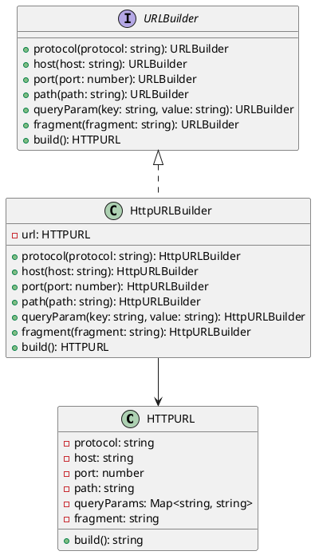

# Exercício 2: Construção de URLs HTTP

## 📋 Descrição do Problema

Crie um sistema para construir URLs HTTP complexas passo a passo. Uma URL pode ter várias partes opcionais: protocolo, host, porta, path, query parameters, fragment.

O problema é que construir URLs com muitos parâmetros opcionais em um construtor seria confuso e propenso a erros.

## 🎯 Objetivo

Implementar o padrão **Builder** para construir URLs HTTP de forma fluente e legível.

## 📐 Sugestão de Solução (PlantUML)

## ✅ Critérios de Avaliação

1. ✅ Interface `URLBuilder` com métodos fluentes
2. ✅ Classe `HTTPURL` com método `build()` que retorna URL string
3. ✅ Implementação `HttpURLBuilder` que constrói passo a passo
4. ✅ Uso fluente: `builder.protocol('https').host('example.com').path('/api').build()`
5. ✅ Testes validando diferentes combinações de URLs

## 💡 Dicas

- Use método `build()` que retorna a string URL formatada
- Valide que protocolo e host são obrigatórios
- Formate query parameters corretamente (key=value&key2=value2)

