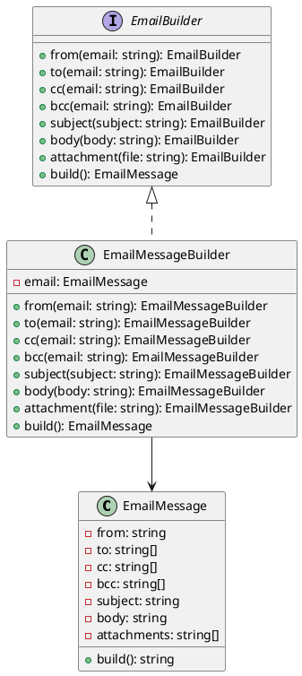

# Exercício 3: Construção de Mensagens de Email

## 📋 Descrição do Problema

Crie um sistema para construir mensagens de email complexas passo a passo. Um email pode ter várias partes opcionais: remetente, destinatário, cópia, cópia oculta, assunto, corpo (texto/HTML), anexos.

O problema é que construir emails com muitos parâmetros opcionais em um construtor seria confuso e propenso a erros.

## 🎯 Objetivo

Implementar o padrão **Builder** para construir emails de forma fluente e legível.

## 📐 Sugestão de Solução (PlantUML)

## ✅ Critérios de Avaliação

1. ✅ Interface `EmailBuilder` com métodos fluentes
2. ✅ Classe `EmailMessage` com método `build()` que retorna email formatado
3. ✅ Implementação `EmailMessageBuilder` que constrói passo a passo
4. ✅ Uso fluente: `builder.from('a@b.com').to('c@d.com').subject('Hi').body('Hello').build()`
5. ✅ Testes validando diferentes combinações de emails

## 💡 Dicas

- Use método `build()` que retorna a string email formatada
- Valide que remetente e destinatário são obrigatórios
- Suporte múltiplos destinatários, CC e BCC

