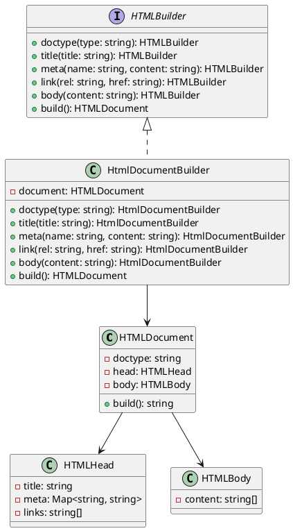

# Exercício 4: Construção de Documentos HTML

## 📋 Descrição do Problema

Crie um sistema para construir documentos HTML complexos passo a passo. Um documento HTML pode ter várias partes opcionais: doctype, head (title, meta, links), body (com vários elementos).

O problema é que construir HTML com muitos parâmetros opcionais em um construtor seria confuso e propenso a erros.

## 🎯 Objetivo

Implementar o padrão **Builder** para construir documentos HTML de forma fluente e legível.

## 📐 Sugestão de Solução (PlantUML)

## ✅ Critérios de Avaliação

1. ✅ Interface `HTMLBuilder` com métodos fluentes
2. ✅ Classe `HTMLDocument` com método `build()` que retorna HTML string
3. ✅ Implementação `HtmlDocumentBuilder` que constrói passo a passo
4. ✅ Uso fluente: `builder.doctype('html').title('Page').body('
Hello
').build()`
5. ✅ Testes validando diferentes documentos HTML

## 💡 Dicas

- Use método `build()` que retorna a string HTML formatada
- Estruture head e body corretamente
- Suporte múltiplos elementos no body

