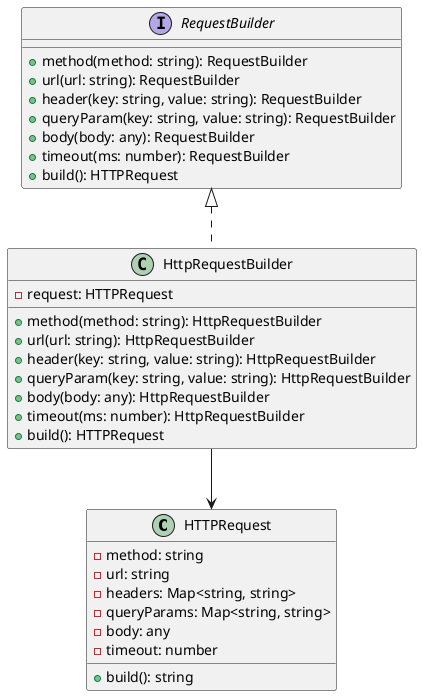

# Exercício 5: Construção de Consultas de API REST

## 📋 Descrição do Problema

Crie um sistema para construir requisições HTTP REST complexas passo a passo. Uma requisição pode ter várias partes opcionais: método HTTP, URL, headers, query parameters, body, timeout.

O problema é que construir requisições com muitos parâmetros opcionais em um construtor seria confuso e propenso a erros.

## 🎯 Objetivo

Implementar o padrão **Builder** para construir requisições HTTP de forma fluente e legível.

## 📐 Sugestão de Solução (PlantUML)

## ✅ Critérios de Avaliação

1. ✅ Interface `RequestBuilder` com métodos fluentes
2. ✅ Classe `HTTPRequest` com método `build()` que retorna requisição formatada
3. ✅ Implementação `HttpRequestBuilder` que constrói passo a passo
4. ✅ Uso fluente: `builder.method('POST').url('/api').body({}).build()`
5. ✅ Testes validando diferentes requisições HTTP

## 💡 Dicas

- Use método `build()` que retorna objeto de requisição
- Valide que método e URL são obrigatórios
- Serialize body para JSON quando necessário

