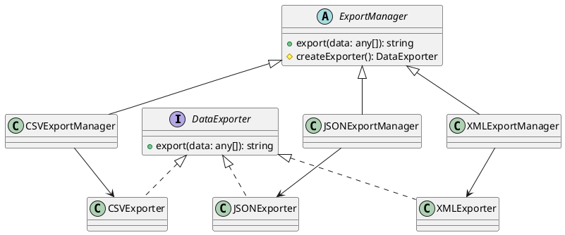

# Exercício 1: Sistema de Exportação de Dados

## 📋 Descrição do Problema

Crie um sistema que exporta dados em diferentes formatos (CSV, JSON, XML). Cada formato tem sua própria implementação de exportação, mas o processo geral é o mesmo: preparar dados → formatar → salvar.

O problema é que o cliente não deve conhecer as classes concretas de cada formato. O sistema deve ser facilmente extensível para novos formatos.

## 🎯 Objetivo

Implementar o padrão **Factory Method** para delegar a criação de exportadores para subclasses.

## 📐 Sugestão de Solução (PlantUML)

## ✅ Critérios de Avaliação

1. ✅ Interface `DataExporter` com método `export`
2. ✅ Implementações concretas para cada formato
3. ✅ Classe abstrata `ExportManager` com factory method
4. ✅ Subclasses decidem qual exportador criar
5. ✅ Testes validando exportação em diferentes formatos

## 💡 Dicas

- O método `export` do `ExportManager` chama `createExporter()` e delega
- Cada subclasse implementa `createExporter()` retornando seu formato
- Use método template se houver lógica comum

