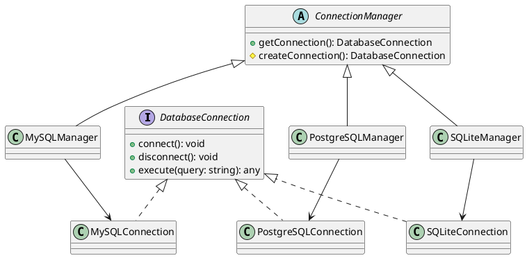

# Exercício 2: Sistema de Criação de Conexões de Banco de Dados

## 📋 Descrição do Problema

Crie um sistema que cria conexões de banco de dados para diferentes tipos (MySQL, PostgreSQL, SQLite). Cada tipo tem sua própria implementação de conexão, mas o processo geral é o mesmo: configurar → conectar → validar.

O problema é que o cliente não deve conhecer as classes concretas de cada tipo de conexão. O sistema deve ser facilmente extensível para novos tipos de banco.

## 🎯 Objetivo

Implementar o padrão **Factory Method** para delegar a criação de conexões para subclasses.

## 📐 Sugestão de Solução (PlantUML)

## ✅ Critérios de Avaliação

1. ✅ Interface `DatabaseConnection` com métodos comuns
2. ✅ Implementações concretas para cada tipo de banco
3. ✅ Classe abstrata `ConnectionManager` com factory method
4. ✅ Subclasses decidem qual conexão criar
5. ✅ Testes validando conexões em diferentes bancos

## 💡 Dicas

- O método `getConnection()` do `ConnectionManager` chama `createConnection()`
- Cada subclasse implementa `createConnection()` retornando seu tipo
- Use método template se houver lógica comum de validação

