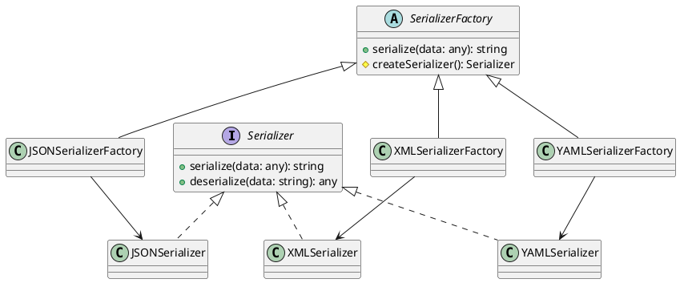

# Exercício 3: Sistema de Criação de Serializadores

## 📋 Descrição do Problema

Crie um sistema que cria serializadores para diferentes formatos (JSON, XML, YAML). Cada formato tem sua própria implementação de serialização, mas o processo geral é o mesmo: validar → serializar → retornar.

O problema é que o cliente não deve conhecer as classes concretas de cada formato. O sistema deve ser facilmente extensível para novos formatos.

## 🎯 Objetivo

Implementar o padrão **Factory Method** para delegar a criação de serializadores para subclasses.

## 📐 Sugestão de Solução (PlantUML)

## ✅ Critérios de Avaliação

1. ✅ Interface `Serializer` com métodos serialize/deserialize
2. ✅ Implementações concretas para cada formato
3. ✅ Classe abstrata `SerializerFactory` com factory method
4. ✅ Subclasses decidem qual serializador criar
5. ✅ Testes validando serialização em diferentes formatos

## 💡 Dicas

- O método `serialize()` do factory chama `createSerializer()` e delega
- Cada subclasse implementa `createSerializer()` retornando seu formato
- Use método template se houver validação comum

