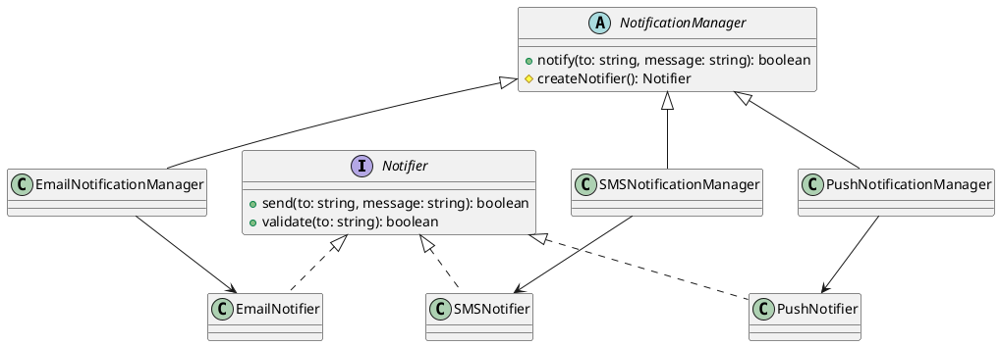

# Exercício 4: Sistema de Criação de Notificadores

## 📋 Descrição do Problema

Crie um sistema que cria notificadores para diferentes canais (Email, SMS, Push). Cada canal tem sua própria implementação de notificação, mas o processo geral é o mesmo: validar → enviar → confirmar.

O problema é que o cliente não deve conhecer as classes concretas de cada canal. O sistema deve ser facilmente extensível para novos canais.

## 🎯 Objetivo

Implementar o padrão **Factory Method** para delegar a criação de notificadores para subclasses.

## 📐 Sugestão de Solução (PlantUML)

## ✅ Critérios de Avaliação

1. ✅ Interface `Notifier` com métodos send/validate
2. ✅ Implementações concretas para cada canal
3. ✅ Classe abstrata `NotificationManager` com factory method
4. ✅ Subclasses decidem qual notificador criar
5. ✅ Testes validando notificações em diferentes canais

## 💡 Dicas

- O método `notify()` do manager chama `createNotifier()` e delega
- Cada subclasse implementa `createNotifier()` retornando seu canal
- Use método template se houver validação comum

