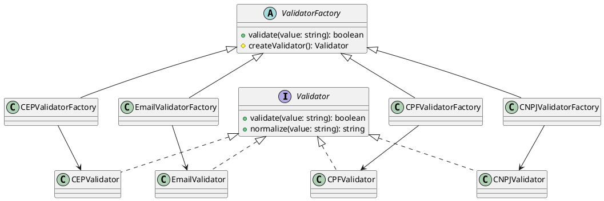

# Exercício 5: Sistema de Criação de Validadores

## 📋 Descrição do Problema

Crie um sistema que cria validadores para diferentes tipos de dados (Email, CPF, CNPJ, CEP). Cada tipo tem sua própria implementação de validação, mas o processo geral é o mesmo: normalizar → validar → retornar.

O problema é que o cliente não deve conhecer as classes concretas de cada tipo. O sistema deve ser facilmente extensível para novos tipos de validação.

## 🎯 Objetivo

Implementar o padrão **Factory Method** para delegar a criação de validadores para subclasses.

## 📐 Sugestão de Solução (PlantUML)

## ✅ Critérios de Avaliação

1. ✅ Interface `Validator` com métodos validate/normalize
2. ✅ Implementações concretas para cada tipo
3. ✅ Classe abstrata `ValidatorFactory` com factory method
4. ✅ Subclasses decidem qual validador criar
5. ✅ Testes validando diferentes tipos de validação

## 💡 Dicas

- O método `validate()` do factory chama `createValidator()` e delega
- Cada subclasse implementa `createValidator()` retornando seu tipo
- Use método template se houver normalização comum

