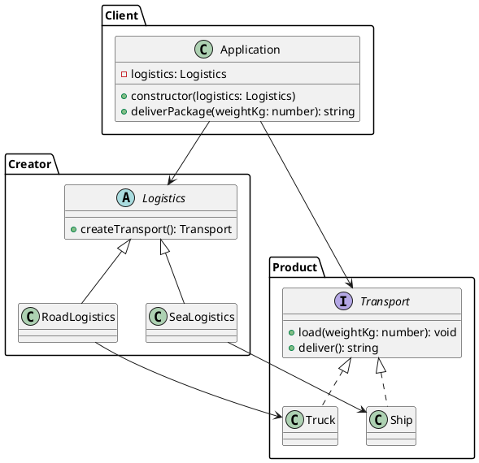

### Por que Factory Method?

Quando você quer delegar a criação de um produto (objeto) para subclasses sem acoplar o cliente a classes concretas. O método fábrica encapsula a decisão de qual produto instanciar.

### Problema: Cenário Caótico SEM Factory Method

**Cliente precisa conhecer classes concretas e criar produtos diretamente:**

```typescript
// ❌ PROBLEMA: Cliente conhece classes concretas
class Application {
  deliverPackage(weightKg: number, type: 'road' | 'sea'): string {
    let transport: Transport;
    
    // ❌ Cliente decide qual classe criar
    if (type === 'road') {
      transport = new Truck(); // Cliente conhece Truck
    } else if (type === 'sea') {
      transport = new Ship(); // Cliente conhece Ship
    } else if (type === 'air') {
      // ❌ Novo tipo = modificar Application
      transport = new Airplane();
    }
    
    transport.load(weightKg);
    return transport.deliver();
  }
}

// ❌ Problemas:
// 1. Cliente acoplado a classes concretas (Truck, Ship)
// 2. Lógica de criação espalhada pelo código
// 3. Difícil adicionar novos tipos sem modificar Application
// 4. Violação do princípio Open/Closed
// 5. Difícil testar (precisa criar objetos concretos)
```

**Problemas:**
- Cliente acoplado a classes concretas
- Lógica de criação espalhada pelo código
- Difícil adicionar novos produtos sem modificar o cliente
- Violação do princípio Open/Closed
- Difícil testar e manter

### Solução: Factory Method Pattern

O Factory Method delega a criação para subclasses:

```typescript
// ✅ SOLUÇÃO: Subclasses decidem qual produto criar
const roadApp = new Application(new RoadLogistics()); // RoadLogistics cria Truck
const seaApp = new Application(new SeaLogistics()); // SeaLogistics cria Ship
```

### Composição (no mesmo estilo do Abstract Factory)

- **Creator (Logistics)**: declara o método fábrica `createTransport()`. Pode fornecer lógica de alto nível que usa o produto retornado.
- **ConcreteCreator (RoadLogistics, SeaLogistics)**: sobrescrevem o método fábrica para retornar produtos concretos específicos.
- **Product (Transport)**: interface comum para todos os produtos criados.
- **ConcreteProduct (Truck, Ship)**: implementações concretas do produto.
- **Client (Application)**: usa apenas a interface `Logistics` e o `Transport` retornado, sem conhecer classes concretas.

---

# PlantUML (diagrama de classes)



---

### Cenário prático

Uma aplicação de logística precisa planejar entregas por diferentes meios de transporte. A escolha do transporte não deve estar espalhada pelo código cliente; em vez disso, subclasses de `Logistics` decidem qual `Transport` concreto criar. Assim, o cliente simplesmente usa `deliverPackage` e a variação concreta (rodoviária ou marítima) fica encapsulada.

### Como usar

```ts
import { Application } from "./application";
import { RoadLogistics } from "./creator/road_logistics";
import { SeaLogistics } from "./creator/sea_logistics";

const roadApp = new Application(new RoadLogistics());
console.log(roadApp.deliverPackage(120)); // Delivering 120kg by road (truck)

const seaApp = new Application(new SeaLogistics());
console.log(seaApp.deliverPackage(5000)); // Delivering 5000kg by sea (ship)
```


