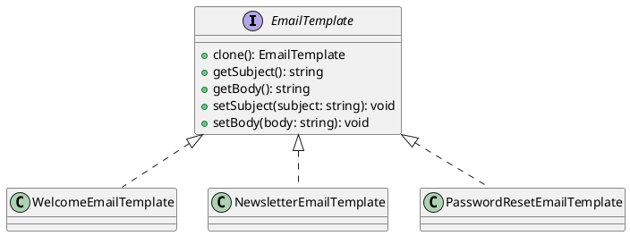

# Exercício 1: Sistema de Templates de Email

## 📋 Descrição do Problema

Crie um sistema de templates de email onde você precisa criar emails similares com pequenas variações. Em vez de criar cada email do zero (que é caro e repetitivo), você clona templates existentes e modifica apenas as partes necessárias.

## 🎯 Objetivo

Implementar o padrão **Prototype** para clonar templates de email.

## 📐 Sugestão de Solução (PlantUML)

## ✅ Critérios de Avaliação

1. ✅ Interface `EmailTemplate` com método `clone()`
2. ✅ Implementações concretas com clonagem profunda
3. ✅ Métodos para acessar e modificar subject/body
4. ✅ Testes validando que clone é independente do original
5. ✅ Testes validando clonagem de objetos aninhados

## 💡 Dicas

- Implemente clonagem profunda (deep copy)
- Use `Object.assign` ou spread operator para clonar
- Garanta que modificações no clone não afetem o original

