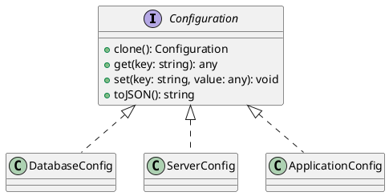

# Exercício 2: Sistema de Clonagem de Configurações

## 📋 Descrição do Problema

Crie um sistema onde você precisa criar configurações similares com pequenas variações. Em vez de criar cada configuração do zero (que é caro e repetitivo), você clona configurações existentes e modifica apenas as partes necessárias.

## 🎯 Objetivo

Implementar o padrão **Prototype** para clonar configurações de sistema.

## 📐 Sugestão de Solução (PlantUML)

## ✅ Critérios de Avaliação

1. ✅ Interface `Configuration` com método `clone()`
2. ✅ Implementações concretas com clonagem profunda
3. ✅ Métodos para acessar e modificar configurações
4. ✅ Testes validando que clone é independente do original
5. ✅ Testes validando clonagem de objetos aninhados

## 💡 Dicas

- Implemente clonagem profunda (deep copy)
- Use `Object.assign` ou spread operator para clonar
- Garanta que modificações no clone não afetem o original
- Suporte configurações aninhadas (objetos dentro de objetos)

