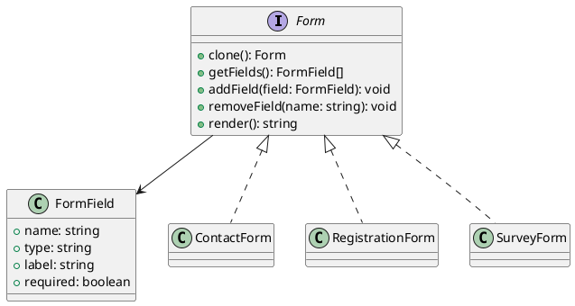

# Exercício 3: Sistema de Clonagem de Formulários

## 📋 Descrição do Problema

Crie um sistema onde você precisa criar formulários similares com pequenas variações. Em vez de criar cada formulário do zero (que é caro e repetitivo), você clona formulários existentes e modifica apenas os campos necessários.

## 🎯 Objetivo

Implementar o padrão **Prototype** para clonar formulários web.

## 📐 Sugestão de Solução (PlantUML)

## ✅ Critérios de Avaliação

1. ✅ Interface `Form` com método `clone()`
2. ✅ Implementações concretas com clonagem profunda
3. ✅ Métodos para gerenciar campos do formulário
4. ✅ Testes validando que clone é independente do original
5. ✅ Testes validando clonagem de campos aninhados

## 💡 Dicas

- Implemente clonagem profunda (deep copy)
- Clone também os campos do formulário
- Garanta que modificações no clone não afetem o original
- Suporte diferentes tipos de campos (text, email, select, etc)

