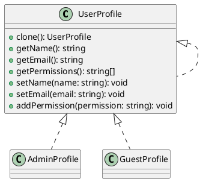

# Exercício 4: Sistema de Clonagem de Perfis de Usuário

## 📋 Descrição do Problema

Crie um sistema onde você precisa criar perfis de usuário similares com pequenas variações. Em vez de criar cada perfil do zero (que é caro e repetitivo), você clona perfis existentes e modifica apenas as informações necessárias.

## 🎯 Objetivo

Implementar o padrão **Prototype** para clonar perfis de usuário.

## 📐 Sugestão de Solução (PlantUML)

## ✅ Critérios de Avaliação

1. ✅ Interface `UserProfile` com método `clone()`
2. ✅ Implementações concretas com clonagem profunda
3. ✅ Métodos para acessar e modificar perfil
4. ✅ Testes validando que clone é independente do original
5. ✅ Testes validando clonagem de arrays e objetos aninhados

## 💡 Dicas

- Implemente clonagem profunda (deep copy)
- Clone também arrays de permissões
- Garanta que modificações no clone não afetem o original
- Suporte diferentes níveis de permissão

