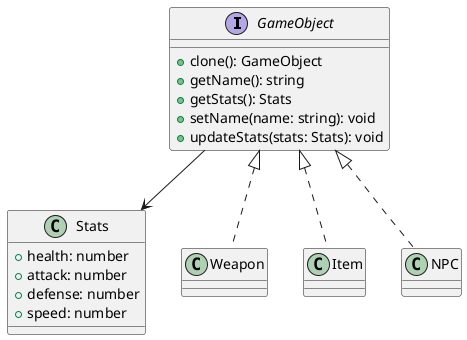

# Exercício 5: Sistema de Clonagem de Objetos de Jogo

## 📋 Descrição do Problema

Crie um sistema de jogo onde você precisa criar objetos similares com pequenas variações (ex: armas, itens, NPCs). Em vez de criar cada objeto do zero (que é caro e repetitivo), você clona objetos existentes e modifica apenas as propriedades necessárias.

## 🎯 Objetivo

Implementar o padrão **Prototype** para clonar objetos de jogo.

## 📐 Sugestão de Solução (PlantUML)

## ✅ Critérios de Avaliação

1. ✅ Interface `GameObject` com método `clone()`
2. ✅ Implementações concretas com clonagem profunda
3. ✅ Métodos para acessar e modificar estatísticas
4. ✅ Testes validando que clone é independente do original
5. ✅ Testes validando clonagem de objetos aninhados (Stats)

## 💡 Dicas

- Implemente clonagem profunda (deep copy)
- Clone também objetos aninhados (Stats)
- Garanta que modificações no clone não afetem o original
- Suporte diferentes tipos de objetos (Weapon, Item, NPC)

