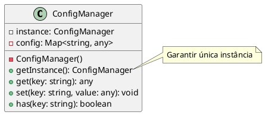

# Exercício 1: Gerenciador de Configurações Global

## 📋 Descrição do Problema

Crie um gerenciador de configurações que precisa ser acessado de vários lugares do sistema. O problema é que se múltiplas instâncias forem criadas, cada uma terá suas próprias configurações, causando inconsistências.

## 🎯 Objetivo

Implementar o padrão **Singleton** para garantir uma única instância do gerenciador de configurações.

## 📐 Sugestão de Solução (PlantUML)

## ✅ Critérios de Avaliação

1. ✅ Construtor privado
2. ✅ Método estático `getInstance()` que retorna única instância
3. ✅ Métodos para gerenciar configurações (get, set, has)
4. ✅ Testes validando que sempre retorna a mesma instância
5. ✅ Testes validando thread-safety (se aplicável)

## 💡 Dicas

- Use `getInstance()` estático para acessar a instância
- Implemente lazy initialization (cria apenas quando necessário)
- Considere adicionar método `reset()` para testes

