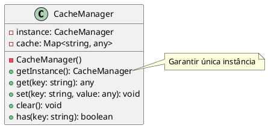

# Exercício 2: Gerenciador de Cache Global

## 📋 Descrição do Problema

Crie um gerenciador de cache que precisa ser acessado de vários lugares do sistema. O problema é que se múltiplas instâncias forem criadas, cada uma terá seu próprio cache, causando inconsistências e desperdício de memória.

## 🎯 Objetivo

Implementar o padrão **Singleton** para garantir uma única instância do gerenciador de cache.

## 📐 Sugestão de Solução (PlantUML)

## ✅ Critérios de Avaliação

1. ✅ Construtor privado
2. ✅ Método estático `getInstance()` que retorna única instância
3. ✅ Métodos para gerenciar cache (get, set, clear, has)
4. ✅ Testes validando que sempre retorna a mesma instância
5. ✅ Testes validando thread-safety (se aplicável)

## 💡 Dicas

- Use `getInstance()` estático para acessar a instância
- Implemente lazy initialization (cria apenas quando necessário)
- Considere adicionar método `reset()` para testes
- Implemente TTL (Time To Live) para entradas do cache

