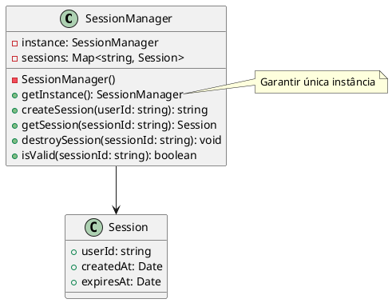

# Exercício 3: Gerenciador de Sessão Global

## 📋 Descrição do Problema

Crie um gerenciador de sessão que precisa ser acessado de vários lugares do sistema. O problema é que se múltiplas instâncias forem criadas, cada uma terá suas próprias sessões, causando inconsistências e perda de dados de sessão.

## 🎯 Objetivo

Implementar o padrão **Singleton** para garantir uma única instância do gerenciador de sessão.

## 📐 Sugestão de Solução (PlantUML)

## ✅ Critérios de Avaliação

1. ✅ Construtor privado
2. ✅ Método estático `getInstance()` que retorna única instância
3. ✅ Métodos para gerenciar sessões (create, get, destroy, isValid)
4. ✅ Testes validando que sempre retorna a mesma instância
5. ✅ Testes validando gerenciamento de múltiplas sessões

## 💡 Dicas

- Use `getInstance()` estático para acessar a instância
- Implemente lazy initialization (cria apenas quando necessário)
- Gere IDs únicos para sessões (UUID ou similar)
- Implemente expiração automática de sessões

