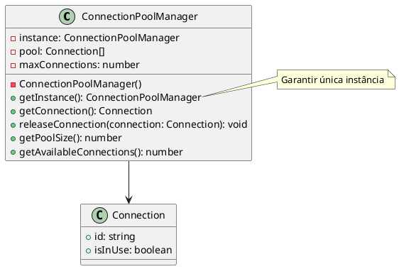

# Exercício 4: Gerenciador de Conexões de Banco de Dados

## 📋 Descrição do Problema

Crie um gerenciador de pool de conexões de banco de dados que precisa ser acessado de vários lugares do sistema. O problema é que se múltiplas instâncias forem criadas, cada uma criará seu próprio pool, causando desperdício de recursos e inconsistências.

## 🎯 Objetivo

Implementar o padrão **Singleton** para garantir uma única instância do gerenciador de pool de conexões.

## 📐 Sugestão de Solução (PlantUML)

## ✅ Critérios de Avaliação

1. ✅ Construtor privado
2. ✅ Método estático `getInstance()` que retorna única instância
3. ✅ Métodos para gerenciar pool (getConnection, releaseConnection)
4. ✅ Testes validando que sempre retorna a mesma instância
5. ✅ Testes validando gerenciamento do pool de conexões

## 💡 Dicas

- Use `getInstance()` estático para acessar a instância
- Implemente lazy initialization (cria apenas quando necessário)
- Limite o número máximo de conexões
- Implemente timeout para conexões ociosas

