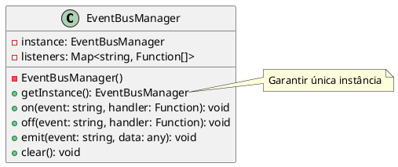

# Exercício 5: Gerenciador de Eventos Global

## 📋 Descrição do Problema

Crie um gerenciador de eventos (Event Bus) que precisa ser acessado de vários lugares do sistema. O problema é que se múltiplas instâncias forem criadas, eventos não serão compartilhados entre componentes, causando falhas na comunicação.

## 🎯 Objetivo

Implementar o padrão **Singleton** para garantir uma única instância do gerenciador de eventos.

## 📐 Sugestão de Solução (PlantUML)

## ✅ Critérios de Avaliação

1. ✅ Construtor privado
2. ✅ Método estático `getInstance()` que retorna única instância
3. ✅ Métodos para gerenciar eventos (on, off, emit, clear)
4. ✅ Testes validando que sempre retorna a mesma instância
5. ✅ Testes validando publicação e assinatura de eventos

## 💡 Dicas

- Use `getInstance()` estático para acessar a instância
- Implemente lazy initialization (cria apenas quando necessário)
- Suporte múltiplos listeners por evento
- Implemente remoção de listeners

