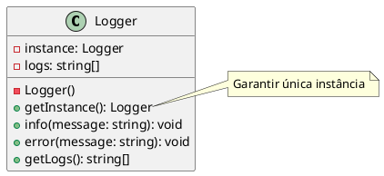

### Por que Singleton?

Quando você precisa garantir uma única instância global com ponto de acesso controlado (ex.: logger, configuração, pool). Use com prudência para evitar acoplamento excessivo.

### Problema: Cenário Caótico SEM Singleton

**Múltiplas instâncias e falta de controle:**

```typescript
// ❌ PROBLEMA: Qualquer um pode criar múltiplas instâncias
class Logger {
  private logs: string[] = [];
  
  info(message: string): void {
    this.logs.push(`INFO: ${message}`);
  }
  
  error(message: string): void {
    this.logs.push(`ERROR: ${message}`);
  }
  
  getLogs(): string[] {
    return this.logs;
  }
}

// ❌ Problema: múltiplas instâncias = logs separados
const logger1 = new Logger();
const logger2 = new Logger();
logger1.info('A');
logger2.error('B');
console.log(logger1.getLogs()); // ['INFO: A'] - não tem o erro de logger2
console.log(logger2.getLogs()); // ['ERROR: B'] - não tem o info de logger1

// ❌ Problemas:
// 1. Não há garantia de instância única
// 2. Cada módulo cria sua própria instância
// 3. Logs ficam fragmentados
// 4. Difícil gerenciar estado global
// 5. Waste de recursos (múltiplas instâncias desnecessárias)
```

**Problemas:**
- Múltiplas instâncias criadas
- Estado global fragmentado
- Difícil gerenciar recursos compartilhados
- Violação do princípio de instância única
- Waste de recursos

### Solução: Singleton Pattern

O Singleton garante uma única instância:

```typescript
// ✅ SOLUÇÃO: Sempre retorna a mesma instância
const a = Logger.getInstance();
const b = Logger.getInstance();
console.log(a === b); // true - mesma instância
```

### Composição

- **Singleton (Logger)**: construtor privado, instância estática, método `getInstance()` e API pública.
- **Client**: recupera a instância via `Logger.getInstance()`.

---

# PlantUML (diagrama de classes)



---

### Uso

```ts
import { Logger } from "./logger";

const a = Logger.getInstance();
const b = Logger.getInstance();
a.info("Started");
b.error("Something happened");
console.log(a.getLogs()); // compartilham o mesmo array
```


