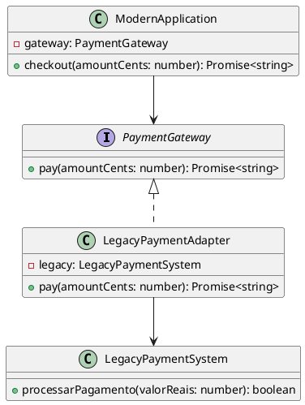

# Exercício 1: Integração com Sistema Legado de Pagamento

## 📋 Descrição do Problema

Você precisa integrar seu sistema moderno com um sistema legado de pagamento. O sistema legado usa uma interface diferente:
- Método: `processarPagamento(valorReais: number): boolean`
- Retorna: `boolean`

Seu sistema espera:
- Método: `pay(amountCents: number): Promise<string>`
- Retorna: `Promise<string>`

## 🎯 Objetivo

Implementar o padrão **Adapter** para adaptar a interface legada para a interface esperada.

## 📐 Sugestão de Solução (PlantUML)

## ✅ Critérios de Avaliação

1. ✅ Interface `PaymentGateway` esperada pelo cliente
2. ✅ Classe `LegacyPaymentSystem` com interface incompatível
3. ✅ Adapter que converte centavos → reais e boolean → Promise<string>
4. ✅ Cliente usa apenas a interface adaptada
5. ✅ Testes validando conversões corretas

## 💡 Dicas

- Converter centavos para reais: `amountCents / 100`
- Converter boolean para Promise: `Promise.resolve(ok ? 'Success' : 'Failed')`
- Trate erros do sistema legado

