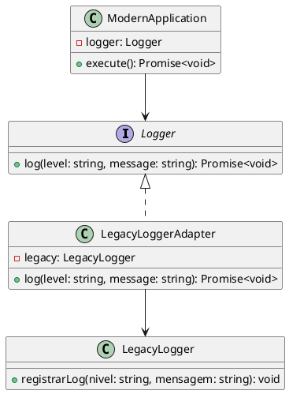

# Exercício 2: Adaptador para Sistema de Logging Legado

## 📋 Descrição do Problema

Você precisa integrar seu sistema moderno com um sistema de logging legado. O sistema legado usa uma interface diferente:
- Método: `registrarLog(nivel: string, mensagem: string): void`
- Não retorna nada

Seu sistema espera:
- Método: `log(level: string, message: string): Promise<void>`
- Retorna Promise

## 🎯 Objetivo

Implementar o padrão **Adapter** para adaptar a interface legada para a interface esperada.

## 📐 Sugestão de Solução (PlantUML)

## ✅ Critérios de Avaliação

1. ✅ Interface `Logger` esperada pelo cliente
2. ✅ Classe `LegacyLogger` com interface incompatível
3. ✅ Adapter que converte interface e retorna Promise
4. ✅ Cliente usa apenas a interface adaptada
5. ✅ Testes validando conversões corretas

## 💡 Dicas

- Converter chamada síncrona para Promise: `Promise.resolve(legacy.registrarLog(...))`
- Mapear níveis de log se necessário
- Trate erros do sistema legado

