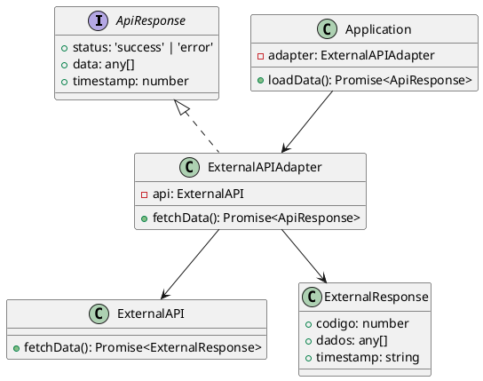

# Exercício 3: Adaptador para API de Terceiros

## 📋 Descrição do Problema

Você precisa integrar seu sistema com uma API de terceiros que usa formato diferente. A API externa retorna:
- Formato: `{ codigo: number, dados: any[], timestamp: string }`

Seu sistema espera:
- Formato: `{ status: 'success' | 'error', data: any[], timestamp: number }`

## 🎯 Objetivo

Implementar o padrão **Adapter** para adaptar a resposta da API externa para o formato esperado.

## 📐 Sugestão de Solução (PlantUML)

## ✅ Critérios de Avaliação

1. ✅ Interface `ApiResponse` esperada pelo cliente
2. ✅ Classe `ExternalAPI` com formato diferente
3. ✅ Adapter que converte formato de resposta
4. ✅ Cliente usa apenas a interface adaptada
5. ✅ Testes validando conversões corretas

## 💡 Dicas

- Converter `codigo` para `status` (0 = success, outros = error)
- Mapear `dados` para `data`
- Converter `timestamp` string para number

