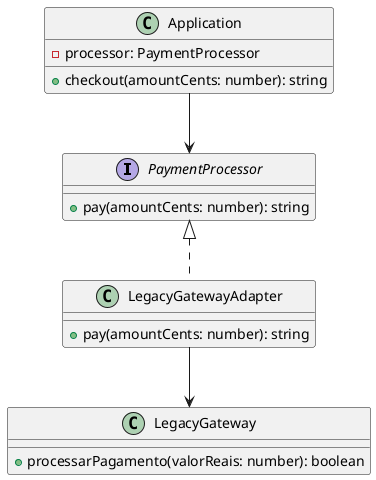

### Por que Adapter?

Permite que classes com interfaces incompatíveis trabalhem juntas, convertendo a interface do Adaptee para a interface esperada pelo Cliente (Target).

### Problema: Cenário Caótico SEM Adapter

**Cliente precisa conhecer múltiplas interfaces incompatíveis:**

```typescript
// ❌ PROBLEMA: Cliente precisa adaptar manualmente cada gateway
class Application {
  checkout(amountCents: number, gateway: 'legacy' | 'modern'): string {
    if (gateway === 'legacy') {
      // ❌ Cliente conhece detalhes do LegacyGateway
      const legacy = new LegacyGateway();
      const valorReais = amountCents / 100; // Conversão manual
      const ok = legacy.processarPagamento(valorReais); // Interface diferente
      return ok ? `Pagamento aprovado: R$ ${valorReais.toFixed(2)}` : 'Recusado';
    } else if (gateway === 'modern') {
      // ❌ Cliente conhece detalhes do ModernGateway
      const modern = new ModernGateway();
      return modern.processPayment(amountCents); // Interface diferente
    }
    // ❌ Mais um gateway = mais um if/else
  }
}

// ❌ Problemas:
// 1. Cliente precisa conhecer todas as interfaces
// 2. Lógica de conversão espalhada pelo código
// 3. Difícil adicionar novos gateways
// 4. Violação do princípio Single Responsibility
// 5. Difícil testar e manter
```

**Problemas:**
- Cliente acoplado a múltiplas interfaces incompatíveis
- Lógica de conversão espalhada pelo código
- Difícil adicionar novos adaptees sem modificar o cliente
- Violação do princípio Open/Closed
- Código difícil de testar e manter

### Solução: Adapter Pattern

O Adapter encapsula a conversão entre interfaces:

```typescript
// ✅ SOLUÇÃO: Cliente usa apenas uma interface
const app = new Application(new LegacyGatewayAdapter(new LegacyGateway()));
app.checkout(12345); // Cliente não conhece detalhes da conversão
```

### Composição

- **Target (PaymentProcessor)**: interface que o cliente espera.
- **Adaptee (LegacyGateway)**: classe existente com interface diferente.
- **Adapter (LegacyGatewayAdapter)**: converte chamadas de `PaymentProcessor` para `LegacyGateway`.
- **Client (Application)**: usa `PaymentProcessor` sem conhecer `LegacyGateway`.

---

# PlantUML



---

### Uso

```ts
import { Application } from "./application";
import { LegacyGateway } from "./adaptee/legacy_gateway";
import { LegacyGatewayAdapter } from "./adapter/legacy_gateway_adapter";

const app = new Application(new LegacyGatewayAdapter(new LegacyGateway()));
console.log(app.checkout(12345));
```


