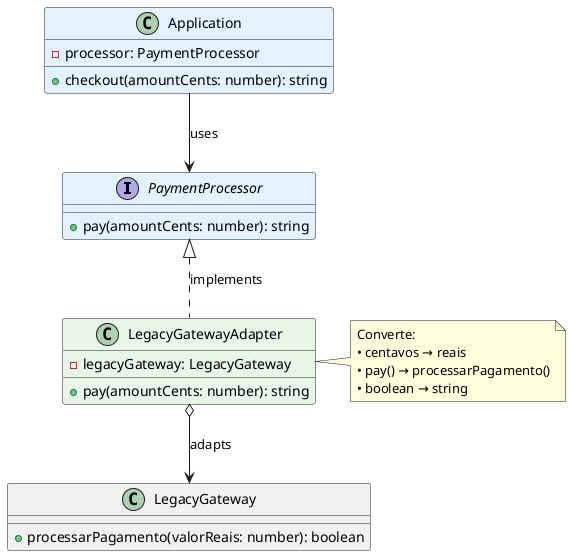

# Adapter Pattern 🔌

## O que é?

O Adapter é como um **adaptador de tomada**: permite que dois sistemas incompatíveis funcionem juntos sem modificar nenhum deles.

---

## 🎯 O Problema Real

Imagine que você tem um sistema de pagamentos funcionando, mas precisa integrar um gateway antigo que usa uma interface completamente diferente:

```typescript
// Seu sistema espera esta interface:
interface PaymentProcessor {
  pay(amountCents: number): string
}

// Mas o gateway antigo usa esta:
class LegacyGateway {
  processarPagamento(valorReais: number): boolean
}
```

**Diferenças problemáticas:**
- ❌ Nomes de métodos diferentes (`pay` vs `processarPagamento`)
- ❌ Unidades diferentes (centavos vs reais)
- ❌ Retornos diferentes (string vs boolean)

---

## ❌ Solução Ruim: Código Espaguete

```typescript
class Application {
  checkout(amountCents: number, gateway: 'legacy' | 'modern'): string {
    if (gateway === 'legacy') {
      const legacy = new LegacyGateway();
      const valorReais = amountCents / 100; // 😱 Conversão manual
      const ok = legacy.processarPagamento(valorReais);
      return ok ? `Aprovado: R$ ${valorReais}` : 'Recusado';
    } 
    
    if (gateway === 'modern') {
      const modern = new ModernGateway();
      return modern.processPayment(amountCents);
    }
    
    // 😱 Cada novo gateway = mais um IF gigante!
  }
}
```

**Por que isso é ruim?**
1. 🔗 **Acoplamento**: Application conhece TODOS os gateways
2. 🔄 **Repetição**: Lógica de conversão espalhada por todo lugar
3. 🚫 **Fechado para extensão**: Adicionar gateway = modificar Application
4. 🧪 **Difícil testar**: Precisa mockar cada gateway diferente
5. 📚 **Responsabilidades misturadas**: Application faz pagamento E conversões

---

## ✅ Solução: Adapter Pattern

### Como funciona?

```
Cliente → [Interface Padrão] → Adapter → [Interface Antiga] → Sistema Legado
          PaymentProcessor                  LegacyGateway
```

O Adapter age como um **tradutor** entre as duas interfaces.

### Implementação

```typescript
// 1️⃣ Interface que seu sistema usa (Target)
interface PaymentProcessor {
  pay(amountCents: number): string
}

// 2️⃣ Sistema legado que você NÃO pode modificar (Adaptee)
class LegacyGateway {
  processarPagamento(valorReais: number): boolean {
    // Lógica complexa do gateway antigo...
    return Math.random() > 0.1;
  }
}

// 3️⃣ Adapter: traduz entre as duas interfaces
class LegacyGatewayAdapter implements PaymentProcessor {
  constructor(private legacyGateway: LegacyGateway) {}

  pay(amountCents: number): string {
    // Toda a conversão fica ENCAPSULADA aqui
    const valorReais = amountCents / 100;
    const sucesso = this.legacyGateway.processarPagamento(valorReais);
    return sucesso 
      ? `✅ Pagamento aprovado: R$ ${valorReais.toFixed(2)}`
      : '❌ Pagamento recusado';
  }
}

// 4️⃣ Cliente: só conhece PaymentProcessor
class Application {
  constructor(private processor: PaymentProcessor) {}

  checkout(amountCents: number): string {
    return this.processor.pay(amountCents); // Simples e limpo!
  }
}
```

### Usando na prática

```typescript
// ✅ Cliente não sabe que está usando sistema legado
const legacyAdapter = new LegacyGatewayAdapter(new LegacyGateway());
const app = new Application(legacyAdapter);

console.log(app.checkout(12345)); // "✅ Pagamento aprovado: R$ 123.45"

// ✅ Adicionar novo gateway? Só criar outro adapter!
class ModernGatewayAdapter implements PaymentProcessor {
  constructor(private modernGateway: ModernGateway) {}
  pay(amountCents: number): string { /* ... */ }
}

const modernAdapter = new ModernGatewayAdapter(new ModernGateway());
const app2 = new Application(modernAdapter);
```

---

## 🏗️ Estrutura do Pattern

```
┌─────────────────┐
│   Application   │ ← Cliente que usa pagamentos
│  (Client)       │
└────────┬────────┘
         │ usa
         ▼
┌─────────────────┐
│PaymentProcessor │ ← Interface padrão (Target)
│  <<interface>>  │
└────────┬────────┘
         │ implementa
         ▼
┌─────────────────┐      adapta      ┌─────────────────┐
│ LegacyGateway   │◄─────────────────│ LegacyGateway   │
│    Adapter      │    (composição)  │   (Adaptee)     │
└─────────────────┘                  └─────────────────┘
   Traduz calls                       Sistema legado
```

**Componentes:**
- **Client** (Application): usa a interface padrão
- **Target** (PaymentProcessor): interface que o client espera
- **Adapter** (LegacyGatewayAdapter): faz a tradução
- **Adaptee** (LegacyGateway): sistema com interface incompatível

---

## 🎁 Benefícios

| Antes (sem Adapter) | Depois (com Adapter) |
|---------------------|----------------------|
| Cliente conhece N interfaces | Cliente conhece 1 interface |
| Conversões espalhadas | Conversão encapsulada |
| Adicionar gateway = modificar cliente | Adicionar gateway = novo adapter |
| Difícil testar | Fácil mockar PaymentProcessor |
| Violação SRP e OCP | Respeita SOLID |

---

## 🔧 Diagrama PlantUML



---

## 📝 Quando Usar?

✅ **Use Adapter quando:**
- Precisar integrar código legado sem modificá-lo
- Quiser isolar conversões complexas de interface
- Precisar trocar implementações facilmente
- Quiser que o cliente dependa de abstrações, não de implementações concretas

❌ **Não use quando:**
- Puder modificar diretamente as classes incompatíveis
- As interfaces já são compatíveis
- A conversão for trivial demais (pode ser overkill)

---

## 🎓 Resumo em uma frase

> **Adapter permite que classes incompatíveis trabalhem juntas criando uma camada intermediária que traduz uma interface em outra, sem modificar nenhuma das duas.**
```

