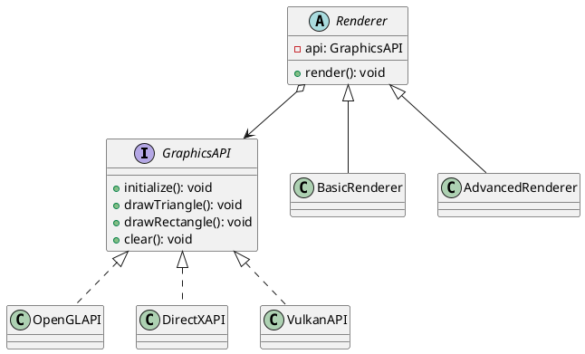

# Exercício 1: Sistema de Renderização Multi-API

## 📋 Descrição do Problema

Crie um sistema de renderização gráfica que funciona com diferentes APIs (OpenGL, DirectX, Vulkan). Cada API tem sua própria implementação, mas o sistema de renderização (abstração) deve funcionar com qualquer API sem precisar ser reescrito.

O problema é que sem Bridge, você teria uma classe para cada combinação (OpenGLRenderer, DirectXRenderer, VulkanRenderer, etc.), causando explosão de classes.

## 🎯 Objetivo

Implementar o padrão **Bridge** para separar abstração (renderização) de implementação (API).

## 📐 Sugestão de Solução (PlantUML)

## ✅ Critérios de Avaliação

1. ✅ Interface `GraphicsAPI` (implementação)
2. ✅ Implementações concretas para cada API
3. ✅ Classe abstrata `Renderer` (abstração)
4. ✅ Renderers podem usar qualquer API
5. ✅ Testes validando renderização com diferentes APIs

## 💡 Dicas

- Renderer usa composição (tem referência a GraphicsAPI)
- Renderers e APIs variam independentemente
- Trocar API = trocar instância, não reescrever código

